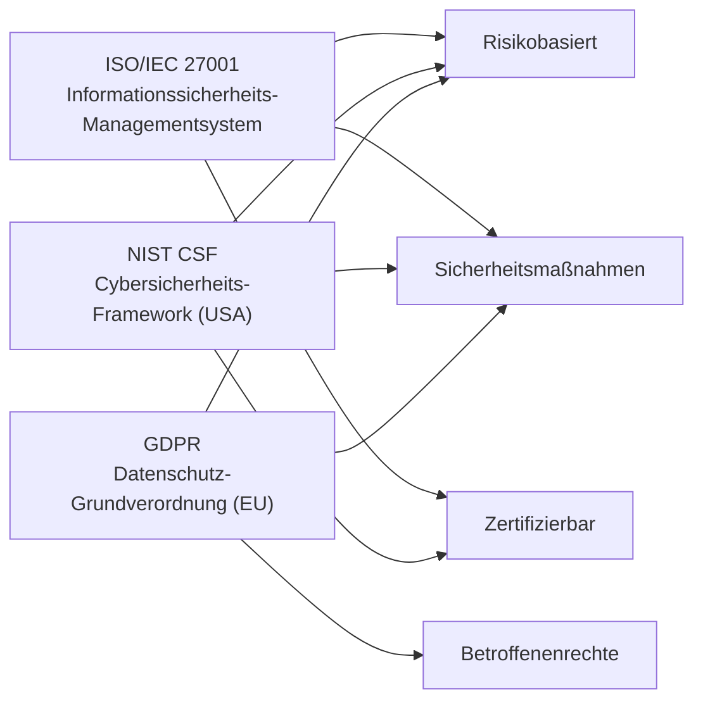

# Vergleich von Sicherheits-Frameworks – ISO 27001, NIST CSF, GDPR

Diese Datei gibt einen strukturierten Überblick über drei zentrale Frameworks und Normen der Informationssicherheit:

- ISO/IEC 27001: Internationaler Standard für Informationssicherheits-Managementsysteme (ISMS)
- NIST Cybersecurity Framework (CSF): Risikobasierter US-Rahmen für Cybersicherheitsmaßnahmen
- EU Datenschutz-Grundverordnung (GDPR): Gesetzliche Vorgaben zum Datenschutz in Europa

---

## 1. Überblick & Zielsetzung der Frameworks

| Framework      | Zielsetzung                                                                 |
|----------------|------------------------------------------------------------------------------|
| ISO/IEC 27001  | Aufbau, Betrieb und kontinuierliche Verbesserung eines ISMS                 |
| NIST CSF       | Strukturierter Leitfaden zur Identifikation, Schutz, Erkennung, Reaktion   |
| GDPR           | Schutz personenbezogener Daten & Sicherstellung der Betroffenenrechte       |

---

## 2. Struktur der Frameworks

| Framework      | Hauptkomponenten / Kernbereiche                                         |
|----------------|-------------------------------------------------------------------------|
| ISO 27001      | Annex A Controls (A.5–A.18), PDCA-Zyklus, Risikomanagement, Audit       |
| NIST CSF       | 5 Kernfunktionen: Identify, Protect, Detect, Respond, Recover           |
| GDPR           | Artikel 1–99, Kap. II: Grundsätze, Kap. III: Rechte, Kap. V: Übermittlung |

---

## 3. Vergleich ausgewählter Inhalte

| Thema                          | ISO/IEC 27001                      | NIST CSF                           | GDPR                                 |
|--------------------------------|------------------------------------|------------------------------------|---------------------------------------|
| Risikomanagement               | zentrales Element (Clause 6.1)     | Bestandteil von „Identify“         | implizit gefordert (Art. 32, 35)     |
| Zugriffskontrolle              | A.9 Access Control                 | Protect Function (PR.AC)           | Art. 25, 32 – Datenschutz durch Technik |
| Sicherheitsvorfälle            | A.16 Incident Management           | Respond Function                   | Art. 33 Meldepflicht bei Verletzungen |
| Technische & organisatorische Maßnahmen (TOM) | A.5–A.18 Controls           | alle Funktionen abgedeckt          | Art. 24, 32 – TOMS vorgeschrieben     |
| Betroffenenrechte              | nicht direkt abgebildet            | nicht enthalten                    | zentrales Element (Kap. III)          |

---

## 4. Gemeinsamkeiten & Unterschiede

### Gemeinsamkeiten

- Alle drei fordern **Schutzmaßnahmen** gegen unbefugten Zugriff, Datenverlust und Angriffe.
- ISO 27001 und NIST CSF sind **umsetzungsorientierte Frameworks**, GDPR ist **gesetzlich bindend**.
- **Risikobasierter Ansatz** ist in allen Frameworks enthalten.

### Unterschiede

| Merkmal              | ISO/IEC 27001            | NIST CSF                  | GDPR                        |
|----------------------|--------------------------|---------------------------|-----------------------------|
| Verbindlichkeit      | freiwillig / zertifizierbar | freiwillig / Leitfaden     | gesetzlich verpflichtend    |
| Geltungsbereich      | Informationssicherheit     | Cybersicherheit             | Datenschutz                  |
| Fokus                | ISMS & kontinuierliche Verbesserung | Schutz kritischer Infrastrukturen | Rechte natürlicher Personen |

---

## 5. Visualisierung: Positionierung der Frameworks

---

## 7. Zusammenfassung

- **ISO/IEC 27001** bietet ein strukturiertes ISMS für Organisationen jeder Größe.
- **NIST CSF** eignet sich besonders für Unternehmen mit kritischer Infrastruktur oder in den USA.
- **GDPR** ist rechtlich bindend in der EU und legt den Fokus auf personenbezogene Daten und Betroffenenrechte.
- Für ganzheitliche Sicherheit empfiehlt sich eine **Kombination aller drei Ansätze** – technisch, organisatorisch und rechtlich.

---

## 8. Weiterführende Links

- [ISO/IEC 27001 Übersicht (EN)](https://www.iso.org/isoiec-27001-information-security.html)
- [NIST Cybersecurity Framework (EN)](https://www.nist.gov/cyberframework)
- [EU DSGVO Volltext (Deutsch)](https://eur-lex.europa.eu/eli/reg/2016/679/oj)
