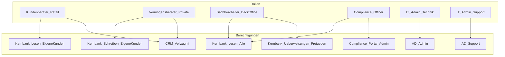

# Praktische Übungen – Identity & Access Management (IAM) Audit

Diese Übungen helfen dir, die theoretischen Konzepte des IAM-Audits praktisch anzuwenden und zu vertiefen.

---

## Übung 1: Rechtematrix erstellen

### Aufgabenstellung

Erstelle eine Rechtematrix für folgendes Szenario:

**Unternehmen:** TechStart GmbH (30 Mitarbeiter)
**Systeme:**
- ERP-System (Finanzen, Einkauf)
- HR-System (Personalakte, Gehälter)
- CRM-System (Kundendaten)
- File-Server (Abteilungslaufwerke)

**Rollen:**
- CEO
- Abteilungsleiter Finanzen
- HR-Manager
- Vertriebsmitarbeiter
- IT-Administrator

**Aufgabe:** Fülle die Matrix aus mit L (Lesen), S (Schreiben), A (Admin), - (kein Zugriff)

### Musterlösung

| Rolle | ERP-System | HR-System | CRM-System | File-Server | Risikoklasse |
|-------|------------|-----------|------------|-------------|--------------|
| CEO | L | L | L | L | Mittel |
| Abteilungsleiter Finanzen | S | - | L | S | Mittel |
| HR-Manager | L (nur Einkauf) | S | - | S | Hoch |
| Vertriebsmitarbeiter | - | - | S | L | Niedrig |
| IT-Administrator | A | A | A | A | **Kritisch** |

**Analyse:**
- IT-Administrator hat kritisches Risiko (volle Admin-Rechte)
- HR-Manager mit Zugriff auf Gehaltsdaten ist sensibel
- CEO hat nur lesenden Zugriff (Least Privilege)

---

## Übung 2: Toxic Combinations identifizieren

### Aufgabenstellung

In folgendem Szenario sind gefährliche Rechtekombinationen versteckt. Identifiziere sie:

**Benutzer A (Finanzen):**
- ERP: Rechnungen erstellen
- ERP: Rechnungen freigeben
- Bank-System: Überweisungen ausführen

**Benutzer B (IT):**
- AD: Benutzer anlegen
- AD: Benutzer löschen
- AD: Passwörter zurücksetzen
- Server: Admin-Zugriff

**Benutzer C (HR):**
- HR-System: Mitarbeiterdaten bearbeiten
- HR-System: Gehälter ändern
- ERP: Lohnauszahlung freigeben

### Musterlösung

| Benutzer | Toxic Combination | Risiko | Empfehlung |
|----------|-------------------|--------|------------|
| **A** | Rechnungen erstellen + freigeben + überweisen | **Kritisch** - Betrugspotenzial | SoD: Trennung von Erstellung, Freigabe, Zahlung |
| **B** | Vollständige AD-Kontrolle + Server-Admin | **Hoch** - Insider Threat | Audit-Logging, 4-Augen-Prinzip |
| **C** | Gehälter ändern + Lohnauszahlung freigeben | **Kritisch** - Gehaltsmanipulation möglich | SoD: Trennung HR und Auszahlung |

**Fazit:** Alle drei Benutzer haben kritische SoD-Verstöße, die gegen ISO 27001 A.6.1.2 und DSGVO Art. 32 verstoßen.

---

## Übung 3: Access Review Simulation

### Aufgabenstellung

Führe einen Access Review für folgende Benutzerliste durch:

| Benutzer | Rolle | Letzte Anmeldung | Status | Berechtigung |
|----------|-------|------------------|--------|--------------|
| m.schmidt | IT Admin | 02.01.2026 | Aktiv | Domain Admin |
| j.mueller | Vertrieb | 15.12.2025 | Aktiv | CRM Vollzugriff |
| a.weber | Ehem. Mitarbeiter | 01.06.2025 | Aktiv | ERP Leserechte |
| k.fischer | Praktikant (beendet) | 30.09.2025 | Aktiv | File-Server Admin |
| s.braun | Elternzeit | 01.03.2025 | Aktiv | HR-System Vollzugriff |

**Aufgabe:** Klassifiziere jeden Benutzer nach: Behalten / Anpassen / Entfernen / Prüfen

### Musterlösung

| Benutzer | Bewertung | Begründung | Maßnahme |
|----------|-----------|------------|----------|
| m.schmidt | ✅ Behalten | Aktiv, legitime Admin-Rolle | Privileged Account Monitoring |
| j.mueller | ✅ Behalten | Aktiv, rollenkonformer Zugriff | - |
| a.weber | 🔴 **Entfernen** | Ehemaliger Mitarbeiter mit aktivem Konto | Sofort deaktivieren (DSGVO-Verstoß!) |
| k.fischer | 🔴 **Entfernen** | Praktikant beendet, Admin-Rechte überhöht | Sofort deaktivieren |
| s.braun | 🟡 **Prüfen/Anpassen** | Elternzeit = temporäre Deaktivierung | Konto suspendieren bis Rückkehr |

**Kritische Findings:**
- 2 verwaiste Konten (a.weber, k.fischer)
- 1 überprivilegiertes Praktikantenkonto
- Verstoß gegen DSGVO Art. 5(1)(f) und ISO 27001 A.9.2.1

---

## Übung 4: Compliance-Mapping

### Aufgabenstellung

Ordne die folgenden IAM-Maßnahmen den entsprechenden Standards zu:

| Maßnahme | ISO 27001:2022 | DSGVO |
|----------|----------------|-------|
| Regelmäßige Passwortänderung | ? | ? |
| Privileged Access Management (PAM) | ? | ? |
| Offboarding-Prozess (Rechtenentzug) | ? | ? |
| Multi-Faktor-Authentifizierung | ? | ? |
| Quartalsmäßige Access Reviews | ? | ? |

### Musterlösung

| Maßnahme | ISO 27001:2022 | DSGVO | Begründung |
|----------|----------------|-------|------------|
| Passwortänderung | A.5.17 | Art. 32 | Authentifizierungsinformationen |
| PAM | A.5.18, A.8.2 | Art. 32 | Privilegierter Zugriff |
| Offboarding | A.5.16, A.6.5 | Art. 5(1)(f), Art. 32 | Identity Lifecycle |
| MFA | A.5.17, A.8.5 | Art. 32 | Sichere Authentifizierung |
| Access Reviews | A.5.18 | Art. 32 | Überprüfung von Zugriffsrechten |

---

## Übung 5: Rollenmodell entwerfen

### Aufgabenstellung

Entwirf ein RBAC-Rollenmodell für eine Bank mit 500 Mitarbeitern:

**Abteilungen:**
- Retail Banking (Kundenberater)
- Private Banking (Vermögensberater)
- Back-Office (Sachbearbeiter)
- Compliance (Compliance Officer)
- IT (Administratoren)

**Systeme:**
- Kernbanksystem
- CRM
- Compliance-Portal
- Active Directory

**Anforderungen:**
1. Kundenberater sehen nur eigene Kunden
2. Compliance hat lesenden Zugriff auf alles
3. IT-Admins haben keine fachlichen Zugriffsrechte
4. SoD: Berater dürfen keine Überweisungen freigeben

### Musterlösung



**SoD-Matrix:**

| Rolle | Kernbank Lesen | Kernbank Schreiben | Überweisungen | AD Admin |
|-------|---------------|-------------------|---------------|----------|
| Kundenberater | ✅ | ❌ | ❌ | ❌ |
| Vermögensberater | ✅ | ✅ | ❌ | ❌ |
| Sachbearbeiter | ✅ | ❌ | ✅ | ❌ |
| Compliance | ✅ | ❌ | ❌ | ❌ |
| IT-Admin | ❌ | ❌ | ❌ | ✅ |

---

## Übung 6: Mini-IAM-Audit Report

### Aufgabenstellung

Schreibe eine Executive Summary (max. 150 Wörter) für folgendes Audit-Ergebnis:

- Geprüfte Konten: 150
- Verwaiste Konten: 8
- Überprivilegierte Konten: 12
- Fehlende MFA: 45%
- Letzter Access Review: vor 18 Monaten

### Musterlösung

```markdown
## Executive Summary – IAM Audit SecureBank AG

**Datum:** [Datum]
**Scope:** 150 Benutzerkonten

### Gesamtbewertung: KRITISCH

Das IAM-Audit zeigt **erhebliche Compliance-Verstöße** gegen ISO 27001 A.9 und DSGVO Art. 32.

### Key Findings
- **8 verwaiste Konten** (ehemalige Mitarbeiter) – DSGVO-Verstoß
- **12 überprivilegierte Konten** – Least Privilege nicht umgesetzt
- **45% ohne MFA** – erhöhtes Kompromittierungsrisiko
- **18 Monate ohne Access Review** – ISO 27001 A.9.2.5 nicht erfüllt

### Sofortmaßnahmen (7 Tage)
1. Verwaiste Konten deaktivieren
2. MFA-Rollout für alle Admin-Konten

### Kurzfristig (30 Tage)
1. Quartalsweisen Access Review etablieren
2. Privileged Access Management einführen

**Risiko-Level:** Hoch
**Compliance-Status:** Nicht konform
```

---

## Checkliste zur Selbstbewertung

Nach Abschluss aller Übungen solltest du diese Fragen beantworten können:

- [ ] Ich kann eine Rechtematrix erstellen und bewerten
- [ ] Ich erkenne Toxic Combinations (SoD-Verstöße)
- [ ] Ich kann einen Access Review durchführen und dokumentieren
- [ ] Ich kenne die relevanten ISO 27001 und DSGVO Controls
- [ ] Ich kann ein RBAC-Rollenmodell entwerfen
- [ ] Ich kann einen Executive Summary für ein IAM-Audit schreiben

---

## Weiterführende Ressourcen

| Ressource | Link |
|-----------|------|
| NIST SP 800-63 (Digital Identity) | https://pages.nist.gov/800-63-3/ |
| ISO 27001:2022 A.5 Access Control | https://www.iso.org/standard/27001 |
| OWASP Identity Verification | https://owasp.org/www-project-web-security-testing-guide/ |

---

> **Tipp:** Dokumentiere deine Lösungen als Portfolio-Nachweis!
