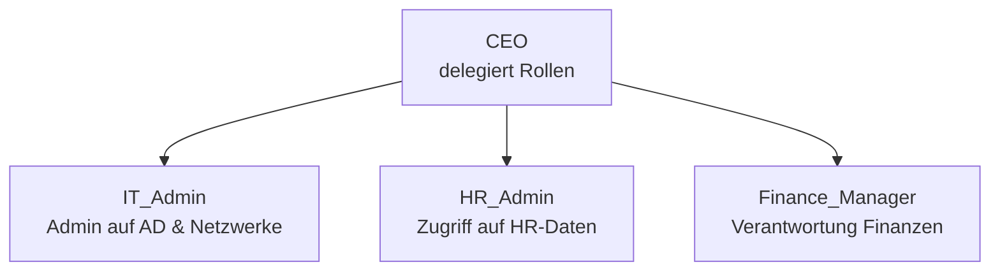

## IAM Rollenmodell – SecureBank AG 
---

## Diagrammerklärung

Dieses Diagramm stellt die zentralen Rollen im **Identity & Access Management (IAM)** System der fiktiven Organisation **SecureBank AG** dar.

---

### 1. CEO
- Höchste Instanz im Berechtigungsmanagement  
- Verantwortet die Delegation aller Systemrollen  
- Kein technischer Zugriff, aber strategische Verantwortung  

---

### 2. IT_Admin
- Technische Administration von Active Directory (AD), Netzwerken, Serverrechten  
- Zugriff auf privilegierte Konten und Konfigurationen  
- Hoher Risikofaktor → regelmäßige Rezertifizierung erforderlich  

---

### 3. HR_Admin
- Verwaltung von Mitarbeitendendaten im HR-System  
- Zugriff auf personenbezogene Daten (nach DSGVO Art. 5 und 32)  
- Eingeschränkte Schreib-/Leserechte, kein technischer Zugriff  

---

### 4. Finance_Manager
- Kontrolle über finanzielle Kernsysteme (ERP, Buchhaltung)  
- Berechtigungen für Report-Export, Controlling und Freigaben  
- Trennung kritischer Funktionen (z. B. Zahlungsauslösung ≠ Buchung)  

---

## Hinweise zur Nutzung

- Das Diagramm visualisiert die Struktur zur Vorbereitung eines **IAM-Audits**  
- Ideal für **Audit-Dokumentation, Access Reviews, Rollenklärung**  
- Basierend auf Best Practices aus **ISO 27001 A.9** und **DSGVO Art. 32**
