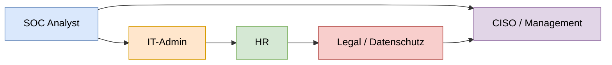

# Eskalationsmatrix – Mermaid-Diagramm

Nachfolgend die Eskalations- und Kommunikationswege als Mermaid-Visualisierung.  
Die Darstellung entspricht dem draw.io-Diagramm: SOC Analyst → IT‑Admin → HR → Legal/Datenschutz, plus direkte Eskalation an CISO/Management.

## Hinweise zur Nutzung
- In GitHub wird das Mermaid-Diagramm direkt gerendert, wenn Mermaid aktiviert ist (Standard).
- Alternativ kann der Code in Tools wie Mermaid Live Editor eingefügt werden.
