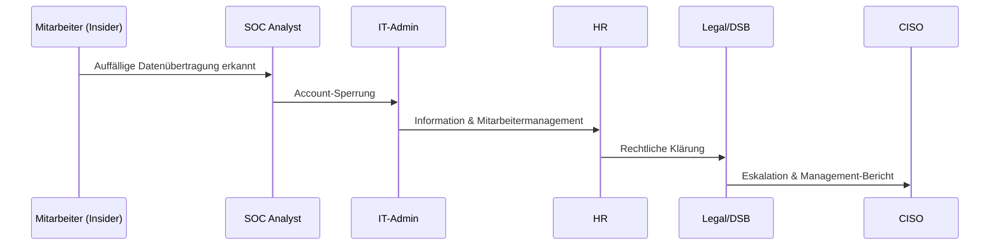

# Incident Response Szenario – Insider Threat

## 1. Szenariobeschreibung
Ein Mitarbeiter mit privilegierten Zugriffsrechten exfiltriert vertrauliche Daten und versucht, diese an einen externen Wettbewerber weiterzugeben.  
Der Vorfall wird durch auffällige Datenübertragungen im SIEM erkannt.

---

## 2. Relevante Standards und Compliance-Bezug
- **NIST SP 800-61r2** – Incident Handling Guide  
- **ISO/IEC 27001 A.9 / A.16** – Access Control, Incident Management  
- **DSGVO Art. 32 & 33** – Zugriffsschutz, Meldepflicht bei Datenpannen  
- **SANS Insider Threat Program**  

---

## 3. Detection & Analysis
**Indikatoren:**
- Große Datenübertragungen auf externe Speicherorte (z. B. Cloud, USB)
- Ungewöhnliche Zugriffsmuster außerhalb der Arbeitszeiten
- Auffällige Kombinationen von Datenzugriffen

**Initiale Maßnahmen:**
- SOC Analyst erkennt exfiltrierte Daten im Monitoring
- Severity: **High (High Impact × Medium Likelihood)**
- Dokumentation der verdächtigen Aktivitäten

---

## 4. Containment
**Kurzfristig:**
- Sofortige Sperrung des Benutzerkontos
- Blockierung des Netzwerkzugriffs
- Sicherstellung der betroffenen Endgeräte

**Mittelfristig:**
- Eskalation an HR, Legal/DSB, CISO
- Interviews mit betroffenen Mitarbeitern
- Forensische Sicherung von Logs und Geräten

---

## 5. Eradication
- Entfernung oder Einschränkung überhöhter Berechtigungen
- Anpassung von IAM-Kontrollen (Least Privilege)
- Schließung von Lücken im Berechtigungsmanagement

---

## 6. Recovery
- Wiederherstellung von Systemzugriffen für unbeteiligte Nutzer
- Anpassung der Zugriffsrechte und Rollen
- Einführung zusätzlicher Überwachungsmechanismen (UEBA)
- Information des Managements über Risiken

---

## 7. Lessons Learned
- Überprüfung und Verbesserung von IAM- und Monitoring-Prozessen
- Awareness-Schulung zu Insider Threats
- KPI-Auswertung: Time-to-Detect, Time-to-Contain, Schadenshöhe
- Anpassung von Playbooks und Eskalationspfaden

---

## 8. Reporting
**Incident Reporting Form (Auszug):**  
- Incident-ID: IR-2025-INSIDER-001  
- Typ: Insider Threat / Datenexfiltration  
- Severity: High  
- Betroffene Systeme: File-Shares, Datenbanken, E-Mail  
- Eskalationsweg: SOC → IT-Admin → HR → Legal/DSB → CISO  
- Behördenmeldung: Ja, falls personenbezogene oder geschäftskritische Daten exfiltriert

---

## 9. Visualisierung – Incident Flow (Mermaid)

