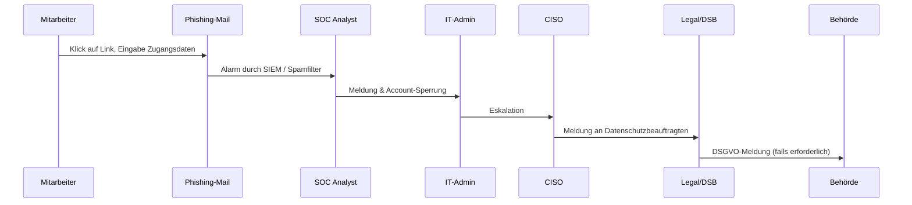

# Incident Response Szenario – Phishing-Angriff

## 1. Szenariobeschreibung
Ein Mitarbeiter erhält eine täuschend echt aussehende E-Mail, die angeblich von der IT-Abteilung stammt.  
Die E-Mail enthält einen Link zu einer gefälschten Login-Seite, auf der der Mitarbeiter seine Zugangsdaten eingibt.  
Kurz darauf werden unautorisierte Zugriffe auf interne Systeme festgestellt.

---

## 2. Relevante Standards und Compliance-Bezug
- **NIST SP 800-61r2** – Incident Handling Guide (Detection, Analysis, Containment, Recovery)
- **ISO/IEC 27001 A.16** – Management von Informationssicherheitsvorfällen
- **DSGVO Art. 33** – Meldepflicht bei Datenschutzverletzungen (72h)
- **SANS Incident Handling Process**

---

## 3. Detection & Analysis
**Indikatoren:**
- Auffällige E-Mail mit externem Link
- Login-Versuche von ungewöhnlichen IP-Adressen
- Mehrere fehlgeschlagene Authentifizierungen kurz nach Klick

**Initiale Maßnahmen:**
- SOC Analyst erkennt Phishing-Mail über SIEM/Spam-Filter-Logs
- Klassifikation anhand Severity Matrix: **High (High Impact × Medium Likelihood)**
- Dokumentation der ersten Beobachtungen (Zeit, Systeme, betroffene User)

---

## 4. Containment
**Kurzfristig:**
- Sperrung des kompromittierten Benutzeraccounts
- Blockieren der Phishing-Domain im E-Mail-Gateway und Proxy
- Alert an alle Mitarbeiter (Awareness, keine Klicks auf ähnliche Mails)

**Mittelfristig:**
- Passwort-Rücksetzung für betroffene Nutzer
- Monitoring aller kritischen Systeme auf Folgeaktivitäten
- Eskalation an IT-Admin und CISO gemäß Eskalationsmatrix

---

## 5. Eradication
- Entfernung der Phishing-Mail aus Postfächern (z. B. via Exchange Admin Center)
- Überprüfung der Endgeräte des betroffenen Mitarbeiters auf Malware
- Identifikation und Schließung möglicher weiterer Einfallstore

---

## 6. Recovery
- Wiederherstellung des kompromittierten Kontos mit neuem Passwort + MFA
- Überprüfung der Logs auf weitere kompromittierte Konten
- Stärkung der E-Mail-Filterregeln und Awareness-Maßnahmen
- Kommunikation mit Stakeholdern (Management, Legal/DSB)

---

## 7. Lessons Learned
- Incident-Dokumentation vollständig im Incident Reporting Form erfassen
- Tabletop-Übung mit Fokus auf Phishing-Erkennung durchführen
- Awareness-Kampagne für alle Mitarbeiter starten (Erkennen von Phishing-Mails)
- KPI-Erhebung: Time-to-Detect, Time-to-Contain, Anzahl betroffener Accounts
- Anpassung des Playbooks (Checklisten, Eskalationspfade)

---

## 8. Reporting
**Incident Reporting Form** (Auszug):  
- Incident-ID: IR-2025-PHISH-001  
- Typ: Phishing-Angriff / Credential Theft  
- Severity: High  
- Betroffene Systeme: Exchange, Active Directory  
- Eskalationsweg: SOC → IT-Admin → CISO → Legal/DSB  
- Behördenmeldung: Ja, falls personenbezogene Daten kompromittiert wurden (DSGVO Art. 33)

---

## 9. Visualisierung – Incident Flow (Mermaid)

---

## 10. Fazit
Dieses Szenario demonstriert ein häufiges Angriffsmuster und zeigt die Wichtigkeit von:  
- Früherkennung durch SIEM und Awareness  
- Klare Eskalationswege und Severity-Bewertung  
- DSGVO-konformes Reporting  
- Kontinuierliche Verbesserung durch Lessons Learned

