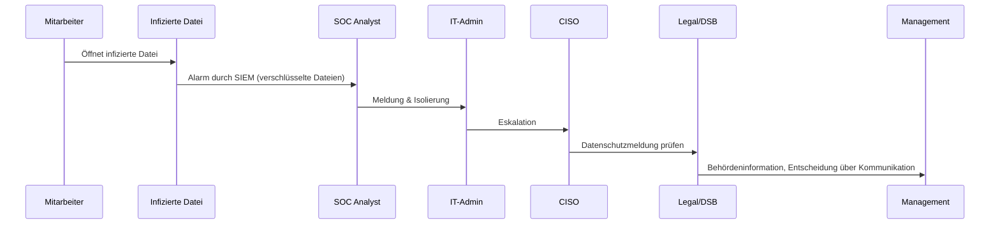

# Incident Response Szenario – Ransomware-Angriff

## 1. Szenariobeschreibung
Ein Mitarbeiter öffnet eine infizierte Datei aus einer E-Mail-Anlage. Kurz darauf verschlüsselt Ransomware produktive Systeme.  
Die Angreifer fordern ein Lösegeld in Kryptowährung, um die Daten wieder freizugeben. Backups sind teilweise betroffen.

---

## 2. Relevante Standards und Compliance-Bezug
- **NIST SP 800-61r2** – Incident Handling Guide (Lifecycle)  
- **ISO/IEC 27001 A.16** – Informationssicherheitsvorfallmanagement  
- **DSGVO Art. 33** – Meldepflicht bei Datenschutzverletzungen  
- **ENISA Threat Landscape Report**  

---

## 3. Detection & Analysis
**Indikatoren:**
- Unerklärlich verschlüsselte Dateien und Systeme
- Ransomware-Meldung auf Bildschirmen
- Massiver Anstieg fehlerhafter Dateizugriffe im SIEM

**Initiale Maßnahmen:**
- SOC erkennt Verschlüsselungswelle
- Severity: **Critical (High Impact × High Likelihood)**
- Dokumentation aller kompromittierten Systeme

---

## 4. Containment
**Kurzfristig:**
- Sofortige Isolierung betroffener Systeme vom Netzwerk
- Sperrung kompromittierter Benutzerkonten
- Deaktivierung von File-Shares

**Mittelfristig:**
- Forensische Sicherung der betroffenen Systeme
- Eskalation an CISO, Legal/DSB, Management
- Information der betroffenen Fachbereiche

---

## 5. Eradication
- Entfernung der Schadsoftware von isolierten Systemen
- Identifikation und Schließung der Einfallstore (z. B. Schwachstellen, Phishing-Mail)
- Vollständige Neuinstallation kompromittierter Systeme

---

## 6. Recovery
- Wiederherstellung der Systeme aus Backups
- Überprüfung, dass Backups nicht kompromittiert wurden
- Monitoring des Netzwerks auf Residualaktivitäten
- Kommunikation mit Stakeholdern und ggf. Behörden

---

## 7. Lessons Learned
- Incident-Dokumentation vollständig im Reporting Form
- Überprüfung der Wirksamkeit von Backups und BCP-Plänen
- Anpassung der Awareness-Programme (Schulung zu E-Mail-Anhängen)
- KPI-Auswertung: Recovery Time, Datenverlust, Kosten

---

## 8. Reporting
**Incident Reporting Form (Auszug):**  
- Incident-ID: IR-2025-RANSOM-001  
- Typ: Ransomware-Angriff / Verschlüsselung  
- Severity: Critical  
- Betroffene Systeme: File-Server, Datenbanken, AD  
- Eskalationsweg: SOC → IT-Admin → CISO → Legal/DSB → Management  
- Behördenmeldung: Ja (DSGVO, ggf. BSI-Meldung)

---

## 9. Visualisierung – Incident Flow (Mermaid)

