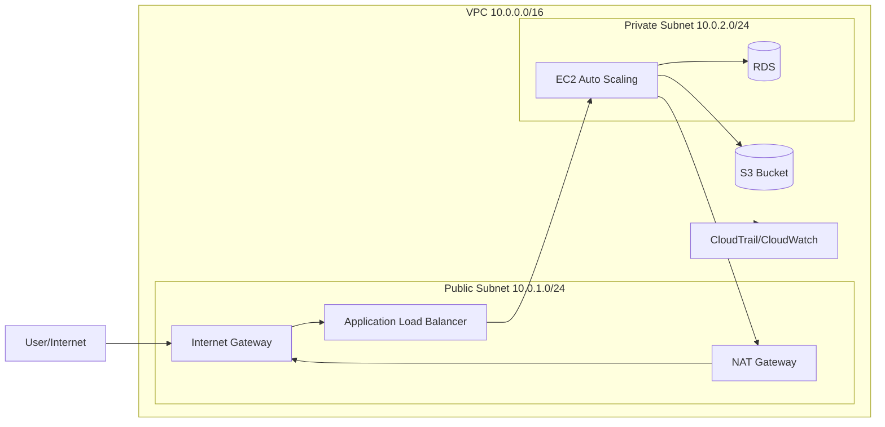

# AWS Architektur (Mermaid)

```mermaid
flowchart LR
    User[User/Internet]
    subgraph AWS[VPC 10.0.0.0/16]
        subgraph Public[Public Subnet 10.0.1.0/24]
            IGW[Internet Gateway]
            ALB[Application Load Balancer]
            NAT[NAT Gateway]
        end
        subgraph Private[Private Subnet 10.0.2.0/24]
            EC2[EC2 Auto Scaling]
            RDS[(RDS)]
        end
        S3[(S3 Bucket)]
        CT[CloudTrail/CloudWatch]
    end

    User --> IGW --> ALB --> EC2
    EC2 --> RDS
    EC2 --> S3
    EC2 --> NAT --> IGW
    AWS --> CT
```
