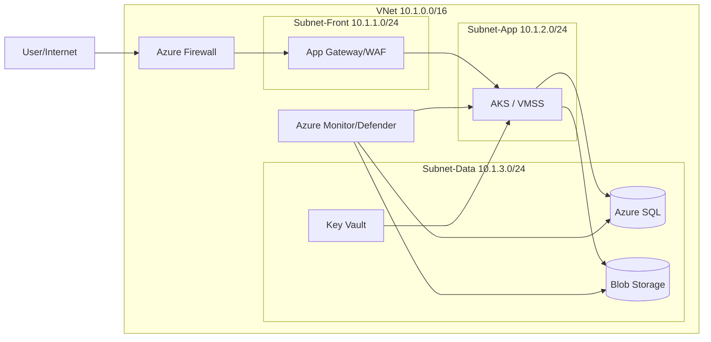

# Azure Architektur (Mermaid)

```mermaid
flowchart LR
    User[User/Internet]
    subgraph Azure[VNet 10.1.0.0/16]
        FW[Azure Firewall]
        subgraph Front[Subnet-Front 10.1.1.0/24]
            AppGW[App Gateway/WAF]
        end
        subgraph App[Subnet-App 10.1.2.0/24]
            AKS[AKS / VMSS]
        end
        subgraph Data[Subnet-Data 10.1.3.0/24]
            SQL[(Azure SQL)]
            Blob[(Blob Storage)]
            KV[Key Vault]
        end
        MON[Azure Monitor/Defender]
    end

    User --> FW --> AppGW --> AKS
    AKS --> SQL
    AKS --> Blob
    KV --> AKS
    MON --> AKS
    MON --> SQL
    MON --> Blob
```
