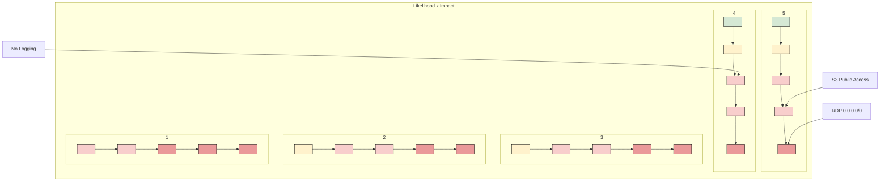

# Risiko-Matrix 5x5 (Mermaid)

```mermaid
flowchart TB
    classDef low fill:#d5e8d4,stroke:#000,color:#000;
    classDef med fill:#fff2cc,stroke:#000,color:#000;
    classDef high fill:#f8cecc,stroke:#000,color:#000;
    classDef vhigh fill:#ea9999,stroke:#000,color:#000;

    subgraph Likelihood x Impact
        direction TB
        subgraph L5[5]
            I1_5[ ]:::low --> I2_5[ ]:::med --> I3_5[ ]:::high --> I4_5[ ]:::high --> I5_5[ ]:::vhigh
        end
        subgraph L4[4]
            I1_4[ ]:::low --> I2_4[ ]:::med --> I3_4[ ]:::high --> I4_4[ ]:::high --> I5_4[ ]:::vhigh
        end
        subgraph L3[3]
            I1_3[ ]:::med --> I2_3[ ]:::high --> I3_3[ ]:::high --> I4_3[ ]:::vhigh --> I5_3[ ]:::vhigh
        end
        subgraph L2[2]
            I1_2[ ]:::med --> I2_2[ ]:::high --> I3_2[ ]:::high --> I4_2[ ]:::vhigh --> I5_2[ ]:::vhigh
        end
        subgraph L1[1]
            I1_1[ ]:::high --> I2_1[ ]:::high --> I3_1[ ]:::vhigh --> I4_1[ ]:::vhigh --> I5_1[ ]:::vhigh
        end
    end

    %% Example placements
    S3Public[S3 Public Access] --> I4_5
    RDP[RDP 0.0.0.0/0] --> I5_5
    NoLog[No Logging] --> I3_4
```
