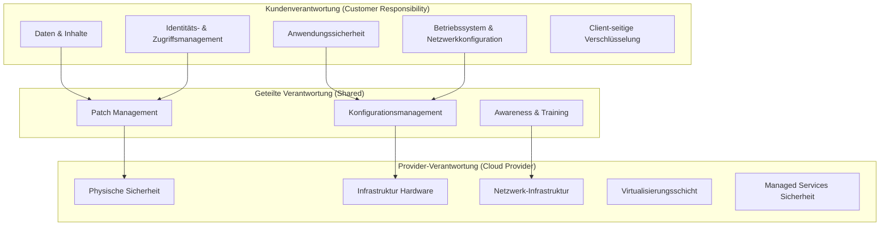
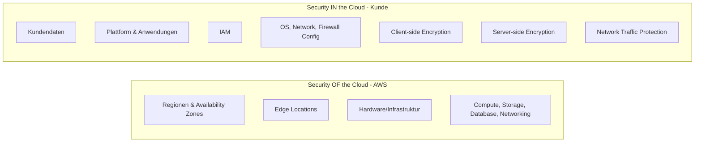

# Shared Responsibility Model – Cloud Security

Dieses Dokument visualisiert das Shared Responsibility Model für Cloud-Dienste und erklärt die Verantwortlichkeiten zwischen Cloud Provider und Kunde.

---

## Übersicht

Das Shared Responsibility Model definiert, welche Sicherheitsaspekte vom Cloud-Anbieter (AWS, Azure, GCP) und welche vom Kunden verantwortet werden. Die Aufteilung variiert je nach Service-Modell (IaaS, PaaS, SaaS).

---

## Visualisierung (Mermaid)

---

## Verantwortlichkeitsmatrix nach Service-Modell

| Sicherheitsaspekt | IaaS | PaaS | SaaS |
|-------------------|------|------|------|
| **Daten** | Kunde | Kunde | Kunde |
| **Endgeräte** | Kunde | Kunde | Kunde |
| **Benutzerkonten & Identitäten** | Kunde | Kunde | Kunde |
| **Identitäts- & Verzeichnisdienste** | Kunde | Geteilt | Provider |
| **Anwendungen** | Kunde | Kunde | Provider |
| **Netzwerk-Kontrollen** | Kunde | Geteilt | Provider |
| **Betriebssystem** | Kunde | Provider | Provider |
| **Physische Hosts** | Provider | Provider | Provider |
| **Physisches Netzwerk** | Provider | Provider | Provider |
| **Physisches Rechenzentrum** | Provider | Provider | Provider |

---

## Detailansicht nach Cloud Provider

### AWS Shared Responsibility

### Azure Shared Responsibility

| Verantwortung | On-Premises | IaaS | PaaS | SaaS |
|---------------|-------------|------|------|------|
| Information & Daten | Kunde | Kunde | Kunde | Kunde |
| Geräte (Mobile & PCs) | Kunde | Kunde | Kunde | Kunde |
| Accounts & Identitäten | Kunde | Kunde | Kunde | Kunde |
| Identitäts-Infrastruktur | Kunde | Kunde | Geteilt | Geteilt |
| Anwendungen | Kunde | Kunde | Geteilt | Microsoft |
| Netzwerk-Controls | Kunde | Kunde | Geteilt | Microsoft |
| Betriebssystem | Kunde | Kunde | Microsoft | Microsoft |
| Physische Hosts | Kunde | Microsoft | Microsoft | Microsoft |
| Physisches Netzwerk | Kunde | Microsoft | Microsoft | Microsoft |
| Physisches Datacenter | Kunde | Microsoft | Microsoft | Microsoft |

---

## Praktische Checkliste für Kunden

### IaaS (z.B. EC2, Azure VMs)

- [ ] OS-Patching und Hardening
- [ ] Firewall-Regeln (Security Groups, NSGs)
- [ ] Antivirus/Endpoint Protection
- [ ] Backup-Strategie
- [ ] Logging und Monitoring
- [ ] IAM-Konfiguration
- [ ] Datenverschlüsselung

### PaaS (z.B. RDS, Azure SQL, Lambda)

- [ ] Anwendungssicherheit
- [ ] IAM und Zugriffsrechte
- [ ] Datenverschlüsselung (at rest & in transit)
- [ ] Netzwerk-Isolation (VPC, Private Endpoints)
- [ ] Logging aktivieren

### SaaS (z.B. Microsoft 365, Salesforce)

- [ ] Benutzer- und Rechteverwaltung
- [ ] MFA aktivieren
- [ ] Datenschutzeinstellungen prüfen
- [ ] DLP-Policies konfigurieren
- [ ] Audit-Logs aktivieren

---

## Häufige Missverständnisse

| Missverständnis | Realität |
|-----------------|----------|
| "Der Cloud Provider sichert alles ab" | Nein – Kunde ist für Daten und Konfiguration verantwortlich |
| "Verschlüsselung ist automatisch aktiv" | Muss oft explizit aktiviert werden (z.B. S3, EBS) |
| "Backups sind inklusive" | Backup-Strategien müssen vom Kunden definiert werden |
| "IAM ist Sache des Providers" | IAM-Konfiguration liegt vollständig beim Kunden |
| "Compliance wird vom Provider garantiert" | Provider liefert Zertifizierungen, Kunde muss Controls umsetzen |

---

## Compliance-Relevanz

### ISO 27001 Controls

| Control | Verantwortung | Beschreibung |
|---------|---------------|--------------|
| A.5.15 | Kunde | Access Control Policies |
| A.8.1 | Kunde | User Endpoint Devices |
| A.8.9 | Geteilt | Configuration Management |
| A.8.10 | Kunde | Information Deletion |
| A.8.24 | Geteilt | Cryptographic Controls |

### GDPR/DSGVO

- **Art. 28**: Auftragsverarbeitung – Vertrag mit Cloud Provider erforderlich
- **Art. 32**: Technische Maßnahmen – Kunde muss angemessene Sicherheit gewährleisten
- **Art. 33/34**: Meldepflichten – Kunde bleibt verantwortlich

---

## Weiterführende Ressourcen

| Ressource | Link |
|-----------|------|
| AWS Shared Responsibility Model | https://aws.amazon.com/compliance/shared-responsibility-model/ |
| Azure Shared Responsibility | https://docs.microsoft.com/en-us/azure/security/fundamentals/shared-responsibility |
| GCP Shared Responsibility | https://cloud.google.com/architecture/framework/security/shared-responsibility-shared-fate |
| CSA Cloud Controls Matrix | https://cloudsecurityalliance.org/research/cloud-controls-matrix/ |

---

> **Lernziel:** Verstehen, dass Cloud Security eine geteilte Verantwortung ist und der Kunde für die Sicherheit "IN" der Cloud verantwortlich bleibt.
