# BCDR Recovery Timeline

## Recovery Timeline Übersicht

```mermaid
gantt
    title Disaster Recovery Timeline
    dateFormat HH:mm
    axisFormat %H:%M
    
    section Phase 1: Initial Response
    Incident Detection           :done, p1a, 00:00, 15m
    CMT Notification             :done, p1b, after p1a, 15m
    Initial Assessment           :active, p1c, after p1b, 30m
    
    section Phase 2: Infrastructure
    Network Recovery             :p2a, after p1c, 30m
    AD/DNS Restore               :p2b, after p2a, 30m
    Core Services                :p2c, after p2b, 30m
    
    section Phase 3: Critical Systems
    Database Cluster             :p3a, after p2c, 60m
    Email System                 :p3b, after p2c, 90m
    ERP Application              :p3c, after p3a, 120m
    
    section Phase 4: Business Operations
    End User Access              :p4a, after p3c, 60m
    Full Service Restoration     :p4b, after p4a, 60m
```



---

## RPO/RTO Visualization

```
Zeit vor Disaster          DISASTER           Zeit nach Disaster
──────────────────────────────●───────────────────────────────────►
                              │
        ◄────────────────────►│◄──────────────────────────────────►
              RPO             │               RTO
       (Datenverlust-         │        (Recovery-Zeit)
        Toleranz)             │

Beispiel:
────────●─────────────────────●───────────────────────●────────────
     Letztes              Disaster              System
     Backup                                    wiederhergestellt
        │◄───────────────────►│◄─────────────────────►│
              RPO = 4h                RTO = 4h
```

---

## Recovery Phases Detail

```
┌─────────────────────────────────────────────────────────────────────┐
│                    DISASTER RECOVERY TIMELINE                        │
├─────────────────────────────────────────────────────────────────────┤
│                                                                      │
│  PHASE 1: RESPONSE (0-60 min)                                       │
│  ┌──────────────────────────────────────────────────────────────┐   │
│  │ 0:00   │ 0:15   │ 0:30   │ 0:45   │ 1:00                    │   │
│  │ Detect │ Alert  │ Assess │ Declare│ Activate                │   │
│  └──────────────────────────────────────────────────────────────┘   │
│                                                                      │
│  PHASE 2: INFRASTRUCTURE (1-2h)                                     │
│  ┌──────────────────────────────────────────────────────────────┐   │
│  │ 1:00          │ 1:30          │ 2:00                        │   │
│  │ Network       │ AD/DNS        │ Core Services               │   │
│  │ RTO: 30min    │ RTO: 30min    │ RTO: 30min                  │   │
│  └──────────────────────────────────────────────────────────────┘   │
│                                                                      │
│  PHASE 3: CRITICAL SYSTEMS (2-6h)                                   │
│  ┌──────────────────────────────────────────────────────────────┐   │
│  │ 2:00    │ 3:00    │ 4:00    │ 5:00    │ 6:00               │   │
│  │ Database│ E-Mail  │ ERP     │ CRM     │ Testing            │   │
│  │ RTO: 1h │ RTO: 2h │ RTO: 4h │ RTO: 4h │                    │   │
│  └──────────────────────────────────────────────────────────────┘   │
│                                                                      │
│  PHASE 4: NORMALIZATION (6-24h)                                     │
│  ┌──────────────────────────────────────────────────────────────┐   │
│  │ 6:00          │ 12:00         │ 24:00                       │   │
│  │ User Access   │ Full Ops      │ Normal Operations          │   │
│  │               │ Validated     │                             │   │
│  └──────────────────────────────────────────────────────────────┘   │
│                                                                      │
└─────────────────────────────────────────────────────────────────────┘
```

---

## System Recovery Sequence


---

## Tier-Based Recovery

```
                    RTO Timeline
                    ─────────────────────────────────────────►
                    15min    1h      4h      24h     72h

TIER 1 ─────────────●
(Mission Critical)  │
AD, DNS, Network    │
                    │
TIER 2 ─────────────┼───────●
(Business Critical) │       │
Database, E-Mail    │       │
                    │       │
TIER 3 ─────────────┼───────┼───────────────●
(Business Important)│       │               │
ERP, CRM, HR        │       │               │
                    │       │               │
TIER 4 ─────────────┼───────┼───────────────┼───────────────●
(Standard)          │       │               │               │
Reporting, Archive  │       │               │               │
                    ▼       ▼               ▼               ▼
```

### Recovery Dependencies


---

## Communication Timeline

```
Timeline    │ Audience          │ Message                    │ Channel
────────────┼───────────────────┼────────────────────────────┼──────────
0:00        │ CMT               │ Incident Alert             │ Phone/SMS
0:15        │ IT Team           │ DR Activation              │ Teams
0:30        │ Management        │ Initial Assessment         │ E-Mail
1:00        │ All Staff         │ Incident Notification      │ Mass SMS
2:00        │ Key Customers     │ Service Impact             │ E-Mail
4:00        │ All Staff         │ Status Update              │ Intranet
6:00        │ Regulators        │ If required (GDPR 72h)     │ Portal
12:00       │ All Stakeholders  │ Progress Update            │ Multiple
24:00       │ All Staff         │ Service Restored           │ E-Mail
```

---

## DR Test Results Tracking


**Hinweis:** Werte > 100% bedeuten, dass die Recovery länger als geplant dauerte.

---

## Recovery Checklist Timeline

### Phase 1: Response (0-60 min)
- [ ] 0:00 - Incident bestätigt
- [ ] 0:15 - CMT informiert
- [ ] 0:30 - Assessment abgeschlossen
- [ ] 0:45 - DR-Entscheidung getroffen
- [ ] 1:00 - DR aktiviert

### Phase 2: Infrastructure (1-2h)
- [ ] 1:00 - DR-Site aktiviert
- [ ] 1:30 - Netzwerk wiederhergestellt
- [ ] 2:00 - AD/DNS funktionsfähig

### Phase 3: Systems (2-6h)
- [ ] 2:00 - Datenbank-Recovery gestartet
- [ ] 3:00 - Datenbank online
- [ ] 4:00 - Core Applications online
- [ ] 6:00 - Alle kritischen Systeme verfügbar

### Phase 4: Normalization (6-24h)
- [ ] 6:00 - User Access aktiviert
- [ ] 12:00 - Full Operations validiert
- [ ] 24:00 - Normalbetrieb bestätigt

---

## Weiterführende Ressourcen

| Ressource | Beschreibung |
|-----------|--------------|
| NIST SP 800-34 | Contingency Planning Guide |
| ISO 22301 | Business Continuity Standard |
| DRI Professional Practices | BC Best Practices |
