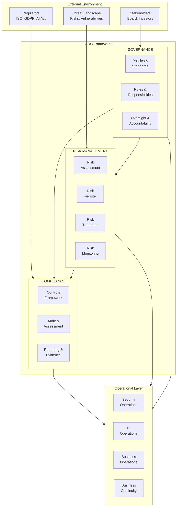
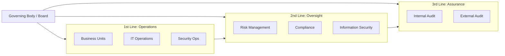
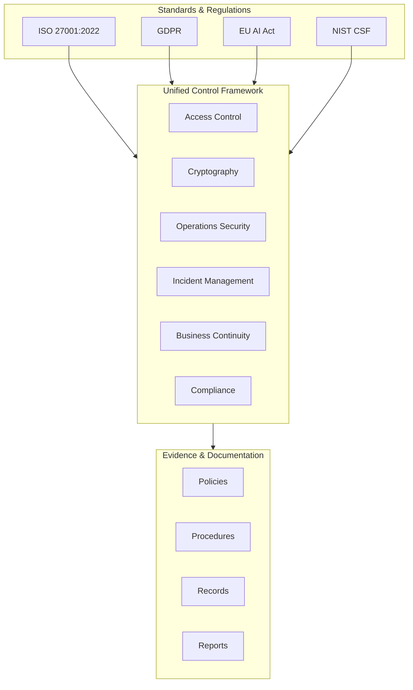
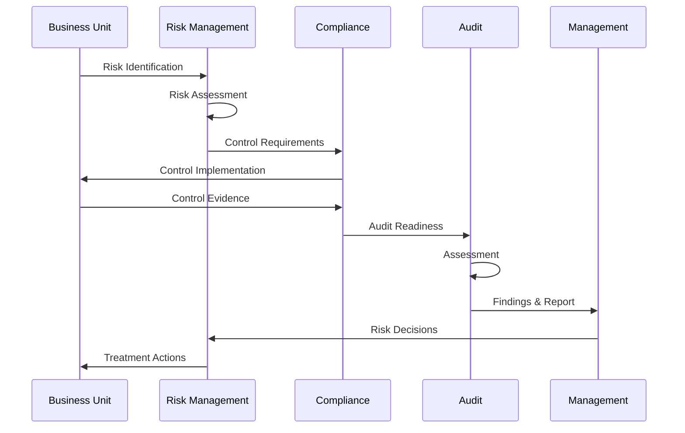
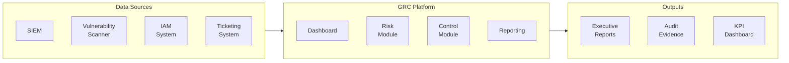

# GRC Architecture – Framework-Übersicht

## GRC Framework Architektur



---

## GRC Integration Model

```
┌─────────────────────────────────────────────────────────────────────┐
│                         BOARD / EXECUTIVE                            │
│                    Strategic Direction & Oversight                   │
└───────────────────────────────┬─────────────────────────────────────┘
                                │
┌───────────────────────────────┴─────────────────────────────────────┐
│                          GRC COMMITTEE                               │
│              CISO • CFO • CLO • CRO • DPO • Audit                   │
└───────────────────────────────┬─────────────────────────────────────┘
                                │
        ┌───────────────────────┼───────────────────────┐
        │                       │                       │
        ▼                       ▼                       ▼
┌───────────────┐       ┌───────────────┐       ┌───────────────┐
│  GOVERNANCE   │       │     RISK      │       │  COMPLIANCE   │
│               │       │               │       │               │
│ • Policies    │◄─────►│ • Risk Mgmt   │◄─────►│ • ISO 27001   │
│ • Standards   │       │ • KRIs        │       │ • GDPR        │
│ • Procedures  │       │ • BIA         │       │ • AI Act      │
│ • Committees  │       │ • BCDR        │       │ • Audits      │
└───────┬───────┘       └───────┬───────┘       └───────┬───────┘
        │                       │                       │
        └───────────────────────┼───────────────────────┘
                                │
┌───────────────────────────────┴─────────────────────────────────────┐
│                         GRC PLATFORM                                 │
│        Risk Register • Control Library • Audit Management            │
│        Document Repository • KPI Dashboard • Reporting               │
└───────────────────────────────┬─────────────────────────────────────┘
                                │
┌───────────────────────────────┴─────────────────────────────────────┐
│                      OPERATIONAL SYSTEMS                             │
│   SIEM • Vuln Mgmt • IAM • CMDB • Ticketing • Training • DR         │
└─────────────────────────────────────────────────────────────────────┘
```

---

## Three Lines Model



### Verantwortlichkeiten

| Line | Rolle | Verantwortung |
|------|-------|---------------|
| **1st Line** | Business/IT Operations | Risiken identifizieren & managen, Controls implementieren |
| **2nd Line** | Risk, Compliance, Security | Überwachung, Beratung, Standards setzen |
| **3rd Line** | Internal/External Audit | Unabhängige Prüfung, Assurance |

---

## Control Framework Integration



---

## GRC Data Flow



---

## GRC Maturity Model

```
Level 5 │ ████████████████████████████████████████ │ Optimized
        │ Continuous improvement, predictive       │
        │                                          │
Level 4 │ ██████████████████████████████          │ Managed
        │ Metrics-driven, quantitative             │
        │                    ▲                     │
Level 3 │ ████████████████████● Current Position  │ Defined
        │ Standardized, documented                 │
        │                                          │
Level 2 │ ████████████████                        │ Repeatable
        │ Basic processes, inconsistent            │
        │                                          │
Level 1 │ ████████                                │ Initial
        │ Ad-hoc, reactive                         │
        └──────────────────────────────────────────┘
```

### Maturity Assessment

| Domain | Current Level | Target | Gap |
|--------|---------------|--------|-----|
| Governance | 3 - Defined | 4 - Managed | +1 |
| Risk Management | 3 - Defined | 4 - Managed | +1 |
| Compliance | 4 - Managed | 4 - Managed | 0 |
| BC/DR | 2 - Repeatable | 3 - Defined | +1 |
| Reporting | 3 - Defined | 4 - Managed | +1 |

---

## KPI Dashboard Architektur

```
┌─────────────────────────────────────────────────────────────────────┐
│                       EXECUTIVE DASHBOARD                            │
│  ┌─────────┐  ┌─────────┐  ┌─────────┐  ┌─────────┐  ┌─────────┐   │
│  │  Risk   │  │  Vuln   │  │Incident │  │Compliance│ │ Access  │   │
│  │  Score  │  │  Trend  │  │  Rate   │  │  Status │  │  KPIs   │   │
│  │   65    │  │   ↓     │  │   12    │  │   92%   │  │   91%   │   │
│  │   🟢    │  │   🟡    │  │   🟢    │  │   🟢    │  │   🟡    │   │
│  └─────────┘  └─────────┘  └─────────┘  └─────────┘  └─────────┘   │
└─────────────────────────────────────────────────────────────────────┘
                                │
        ┌───────────────────────┼───────────────────────┐
        │                       │                       │
        ▼                       ▼                       ▼
┌───────────────┐       ┌───────────────┐       ┌───────────────┐
│ Risk Register │       │   Control     │       │    Audit      │
│               │       │   Library     │       │  Findings     │
│ 7 active      │       │ 114 controls  │       │ 3 open        │
│ risks         │       │ mapped        │       │ findings      │
└───────────────┘       └───────────────┘       └───────────────┘
```

---

## Tool Integration



---

## Weiterführende Ressourcen

| Ressource | Link |
|-----------|------|
| ISACA COBIT | https://www.isaca.org/resources/cobit |
| IIA Three Lines Model | https://www.theiia.org/en/content/articles/global-knowledge-brief/2020/july/the-iias-three-lines-model/ |
| NIST CSF | https://www.nist.gov/cyberframework |
| ISO 27001 | https://www.iso.org/standard/27001 |
