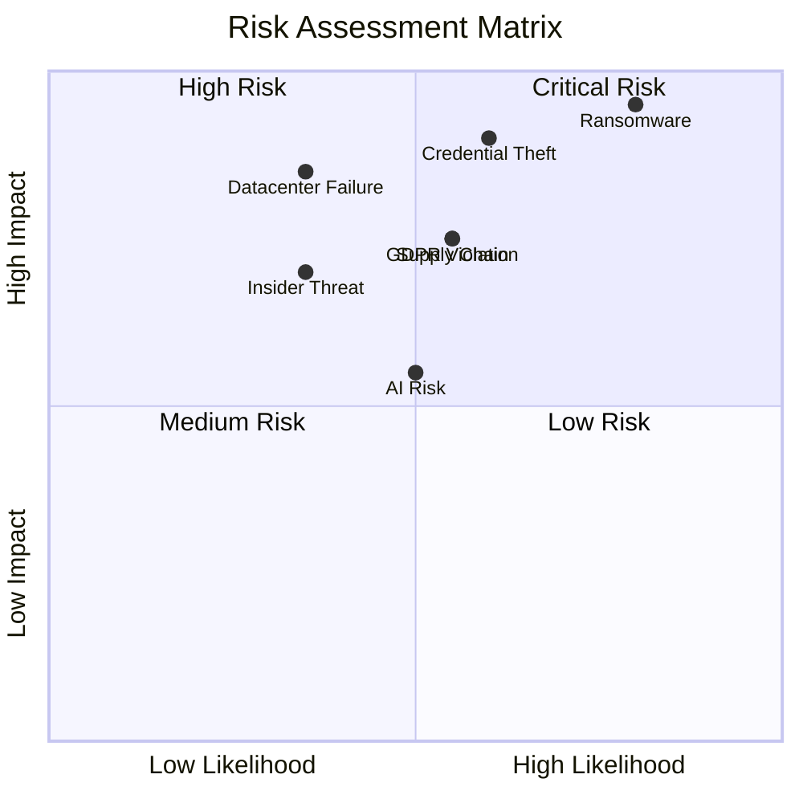
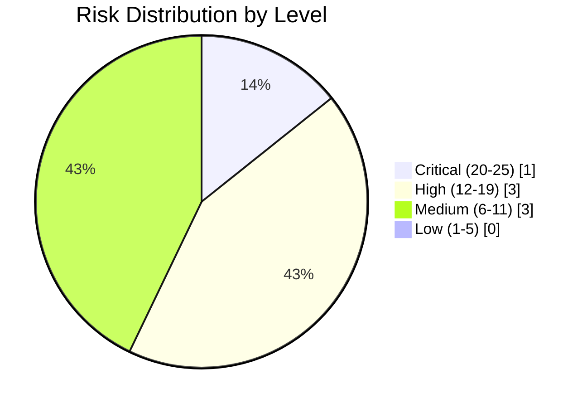
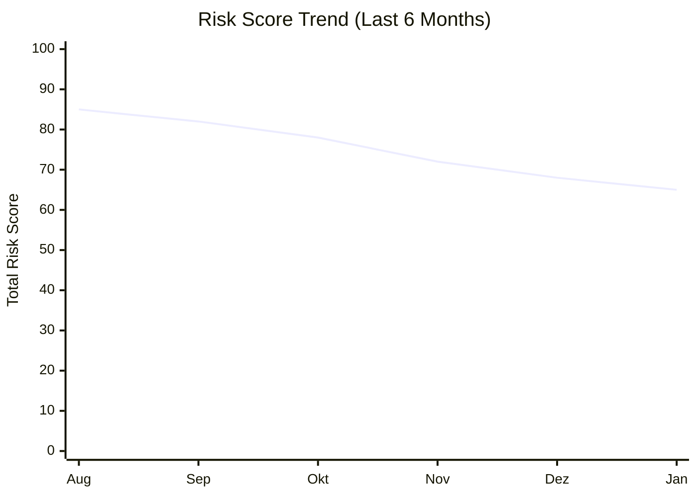

# Risk Matrix – Visualisierung

## 5×5 Risk Matrix



---

## Risk Matrix Tabelle

```
                        LIKELIHOOD
                Rare    Unlikely    Possible    Likely    Almost Certain
                (1)       (2)         (3)        (4)          (5)
         ┌─────────────────────────────────────────────────────────────┐
    (5)  │   10        15          20          25           25        │
Catas-   │ MEDIUM     HIGH        HIGH      CRITICAL     CRITICAL    │
trophic  │            R-003                  R-001                    │
         ├─────────────────────────────────────────────────────────────┤
    (4)  │    8        12          15          20           20        │
Major    │ MEDIUM    MEDIUM       HIGH        HIGH       CRITICAL    │
         │            R-004       R-002                               │
         │                        R-005                               │
         │                        R-006                               │
IMPACT   ├─────────────────────────────────────────────────────────────┤
    (3)  │    6         9          12          15           15        │
Moderate │  LOW      MEDIUM      MEDIUM       HIGH         HIGH      │
         │                        R-007                               │
         ├─────────────────────────────────────────────────────────────┤
    (2)  │    4         6           8          10           12        │
Minor    │  LOW       LOW       MEDIUM      MEDIUM        HIGH       │
         │                                                            │
         ├─────────────────────────────────────────────────────────────┤
    (1)  │    2         3           4           6            8        │
Insignif.│  LOW       LOW        LOW        MEDIUM       MEDIUM      │
         │                                                            │
         └─────────────────────────────────────────────────────────────┘
```

---

## Risk Level Definitionen

### Farbcodierung

| Level | Score | Farbe | Beschreibung |
|-------|-------|-------|--------------|
| **Critical** | 20-25 | 🔴 Rot | Sofortiges Handeln erforderlich |
| **High** | 12-19 | 🟠 Orange | Prioritäre Behandlung |
| **Medium** | 6-11 | 🟡 Gelb | Geplante Behandlung |
| **Low** | 1-5 | 🟢 Grün | Akzeptabel, Monitoring |

---

## Aktuelle Risiko-Verteilung



---

## Risk Trend Chart



---

## Risk Heat Map nach Kategorie

```
                    Inherent Risk          Residual Risk
                    ───────────────        ───────────────
Technisch           ██████████ (20)       ████████   (8)
Compliance          ███████████████ (15)  ████████   (8)
Extern              ████████████ (12)     ██████     (6)
Menschlich          ████████   (8)        ███        (3)
Operativ            ██████████ (10)       ██████     (6)
AI Risk             █████████  (9)        ████       (4)
                    └────────────────────────────────────┘
                    0    5    10   15   20   25
```

---

## Inherent vs. Residual Risk

```mermaid
---
config:
  xyChart:
    width: 600
    height: 400
---
xychart-beta
    title "Inherent vs. Residual Risk Comparison"
    x-axis ["R-001", "R-002", "R-003", "R-004", "R-005", "R-006", "R-007"]
    y-axis "Risk Score" 0 --> 25
    bar [20, 15, 10, 8, 12, 12, 9]
    bar [8, 8, 6, 3, 6, 6, 4]
```



**Legende:**
- Dunkel: Inherent Risk (vor Maßnahmen)
- Hell: Residual Risk (nach Maßnahmen)

---

## Risk Appetite vs. Current Position

```
Risk Appetite Scale
═══════════════════════════════════════════════════════════════════

                     RISK APPETITE                CURRENT POSITION
                         ↓                              ↓
├─────────┼─────────┼─────────┼─────────┼─────────┤
│ AVERSE  │ MINIMAL │ CAUTIOUS│  OPEN   │ HUNGRY  │
│         │         │    ●    │         │         │
├─────────┼─────────┼─────────┼─────────┼─────────┤
   0-20      21-40     41-60     61-80     81-100

Current Risk Exposure Index: 45 (Within Tolerance ✅)
Risk Appetite Level: CAUTIOUS (41-60)
```

---

## Nutzung der Risk Matrix

### 1. Risikobewertung
1. Likelihood (1-5) bestimmen
2. Impact (1-5) bestimmen  
3. Score berechnen (L × I)
4. In Matrix einordnen

### 2. Behandlungsentscheidung
- **Critical/High:** Behandlung erforderlich
- **Medium:** Behandlung empfohlen
- **Low:** Akzeptieren und monitoren

### 3. Reporting
- Matrix in Management-Reports verwenden
- Trend über Zeit darstellen
- Inherent vs. Residual vergleichen

---

## Weiterführende Ressourcen

| Ressource | Link |
|-----------|------|
| ISO 27005:2022 | Risk Management Standard |
| NIST SP 800-30 | Risk Assessment Guide |
| FAIR | Factor Analysis of Information Risk |
