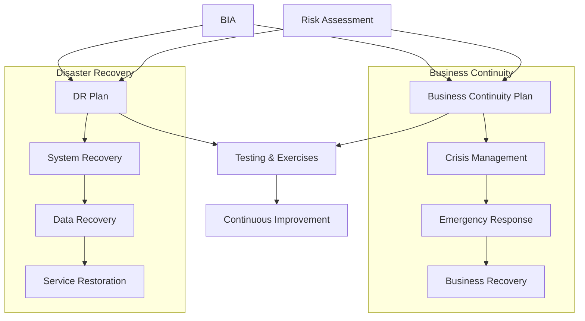
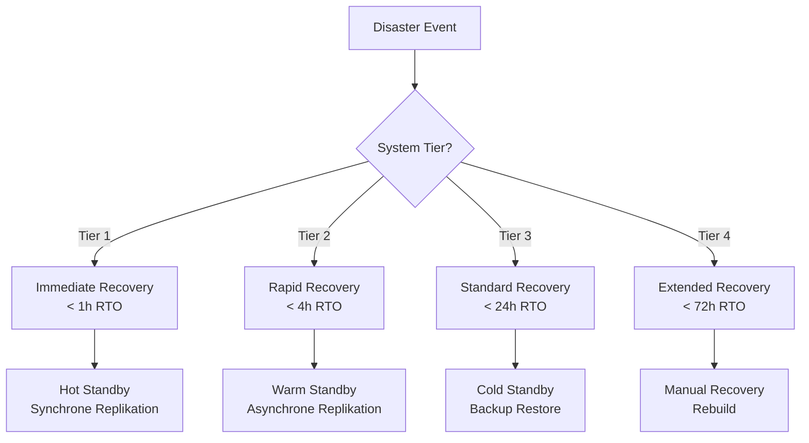
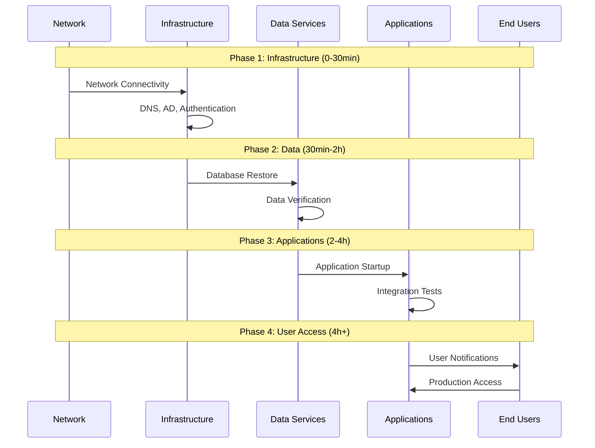

# Business Continuity & Disaster Recovery (BCDR) Planning

## Überblick

BCDR umfasst die Strategien und Pläne zur Aufrechterhaltung kritischer Geschäftsfunktionen während und nach einem Störfall sowie die Wiederherstellung von IT-Systemen nach einem Disaster.

---

## BCDR Framework



---

## Business Continuity vs. Disaster Recovery

| Aspekt | Business Continuity (BC) | Disaster Recovery (DR) |
|--------|--------------------------|------------------------|
| **Fokus** | Geschäftsprozesse | IT-Systeme |
| **Ziel** | Fortführung des Betriebs | Wiederherstellung der IT |
| **Scope** | Menschen, Prozesse, Technologie | Technologie, Daten |
| **Verantwortung** | Business Units | IT-Abteilung |
| **Trigger** | Jede Geschäftsunterbrechung | IT-Ausfall, Disaster |

---

## BC Plan Komponenten

### 1. Crisis Management

**Ziel:** Koordinierte Reaktion auf Krisen auf Führungsebene.

#### Crisis Management Team

| Rolle | Verantwortung | Backup |
|-------|---------------|--------|
| Crisis Manager | Gesamtleitung, Entscheidungen | Deputy |
| Communications Lead | Interne/externe Kommunikation | PR Manager |
| Operations Lead | Betriebliche Maßnahmen | Ops Manager |
| IT Lead | Technische Wiederherstellung | IT Manager |
| HR Lead | Mitarbeiterbelange | HR Manager |
| Legal Lead | Rechtliche Aspekte | External Counsel |

#### Eskalationsstufen

| Stufe | Beschreibung | Aktivierung | Authority |
|-------|--------------|-------------|-----------|
| **Level 1** | Lokaler Incident | Department Head | Abteilungsbudget |
| **Level 2** | Business Unit Incident | BU Director | BU Budget |
| **Level 3** | Unternehmensweite Krise | CEO / CMT | Unbegrenzt |

---

### 2. Emergency Response

**Ziel:** Sofortige Schutzmaßnahmen für Leben und Sicherheit.

#### Response-Kategorien

| Kategorie | Beispiele | Erstmaßnahmen |
|-----------|-----------|---------------|
| **Feuer** | Brand im Gebäude | Evakuierung, Feuerwehr |
| **Naturkatastrophe** | Überschwemmung, Sturm | Evakuierung, Absicherung |
| **Cyber-Angriff** | Ransomware, DDoS | Isolation, IR-Team |
| **Stromausfall** | Netzausfall, USV-Versagen | Notgeneratoren, Kommunikation |
| **Pandemie** | Krankheitsausbruch | Remote Work, Hygienemaßnahmen |

---

### 3. Business Recovery

**Ziel:** Wiederherstellung kritischer Geschäftsprozesse.

#### Recovery-Strategien

| Strategie | Beschreibung | Kosten | RTO |
|-----------|--------------|--------|-----|
| **Hot Site** | Vollständig ausgestatteter Standby-Standort | €€€€€ | < 1h |
| **Warm Site** | Teilweise ausgestatteter Standort | €€€€ | 4-24h |
| **Cold Site** | Leerer Raum mit Infrastruktur | €€€ | 1-7 Tage |
| **Remote Work** | Dezentrales Arbeiten | €€ | < 4h |
| **Reciprocal Agreement** | Vereinbarung mit Partner | € | Variabel |

#### Workaround-Verfahren

| Prozess | Normal | Workaround | Dauer |
|---------|--------|------------|-------|
| Auftragserfassung | ERP-System | Excel + E-Mail | Bis 72h |
| Zahlungen | Online-Banking | Telefon-Banking | Bis 24h |
| Kundenservice | CRM + Telefonie | Mobiltelefone | Bis 48h |
| E-Mail | Exchange | Webmail / Privat | Bis 24h |

---

## DR Plan Komponenten

### 1. System Recovery

#### Recovery-Tiers



#### System-Klassifizierung

| Tier | Systeme | Recovery-Methode | RTO | RPO |
|------|---------|------------------|-----|-----|
| **1** | Core DB, AD, DNS | Active-Active Cluster | 15min | 0 |
| **2** | ERP, CRM, E-Mail | Hot Standby + Replikation | 1h | 15min |
| **3** | HR, Reporting | VM Backup Restore | 4h | 1h |
| **4** | Dev/Test, Archive | Cold Backup Restore | 24h | 24h |

---

### 2. Data Recovery

#### Backup-Strategie (3-2-1 Regel)

```
3 Kopien der Daten
2 verschiedene Medientypen
1 Offsite-Kopie
```

#### Backup-Matrix

| System | Backup-Typ | Frequenz | Retention | Offsite |
|--------|------------|----------|-----------|---------|
| Datenbanken | Full + Incremental | Täglich + Stündlich | 30 Tage | ✅ Cloud |
| Fileserver | Full + Differential | Wöchentlich + Täglich | 90 Tage | ✅ Cloud |
| E-Mail | Continuous | Real-time | 1 Jahr | ✅ Cloud |
| Systeme (VM) | Snapshot | Täglich | 14 Tage | ✅ DR-Site |
| Konfigurationen | Git + Export | Bei Änderung | Unbegrenzt | ✅ Cloud |

---

### 3. Service Restoration

#### Restore-Sequenz



---

## DR-Site Architektur

```
┌─────────────────────────────────────────────────────────────────┐
│                    PRIMARY SITE (Active)                         │
├─────────────────┬─────────────────┬─────────────────────────────┤
│    Compute      │    Storage      │         Network             │
│  ┌───────────┐  │  ┌───────────┐  │  ┌───────────────────────┐  │
│  │ Web/App   │  │  │ SAN/NAS   │  │  │ Load Balancer         │  │
│  │ Servers   │  │  │ Storage   │  │  │ Firewall              │  │
│  └───────────┘  │  └───────────┘  │  │ VPN Gateway           │  │
│  ┌───────────┐  │  ┌───────────┐  │  └───────────────────────┘  │
│  │ Database  │  │  │ Backup    │  │                             │
│  │ Cluster   │  │  │ Storage   │  │                             │
│  └───────────┘  │  └───────────┘  │                             │
└────────┬────────┴────────┬────────┴─────────────────────────────┘
         │                 │
         │  Synchrone      │  Asynchrone
         │  Replikation    │  Replikation
         │                 │
┌────────┴────────┬────────┴────────┬─────────────────────────────┐
│                    DR SITE (Standby)                             │
├─────────────────┬─────────────────┬─────────────────────────────┤
│    Compute      │    Storage      │         Network             │
│  ┌───────────┐  │  ┌───────────┐  │  ┌───────────────────────┐  │
│  │ Standby   │  │  │ Replicated│  │  │ DR Load Balancer      │  │
│  │ Servers   │  │  │ Storage   │  │  │ DR Firewall           │  │
│  └───────────┘  │  └───────────┘  │  │ DR VPN Gateway        │  │
│  ┌───────────┐  │  ┌───────────┐  │  └───────────────────────┘  │
│  │ Standby   │  │  │ Backup    │  │                             │
│  │ Database  │  │  │ Storage   │  │                             │
│  └───────────┘  │  └───────────┘  │                             │
└─────────────────┴─────────────────┴─────────────────────────────┘
```

---

## BCDR Testing

### Test-Typen

| Test-Typ | Beschreibung | Frequenz | Aufwand |
|----------|--------------|----------|---------|
| **Checklist Review** | Dokumentenprüfung | Monatlich | Gering |
| **Tabletop Exercise** | Szenarien-Diskussion | Quartalsweise | Mittel |
| **Walkthrough** | Prozess-Durchgang | Halbjährlich | Mittel |
| **Simulation** | Teilweiser Test | Jährlich | Hoch |
| **Full-Scale Test** | Kompletter DR-Test | Jährlich | Sehr hoch |

### Test-Dokumentation

| Element | Beschreibung |
|---------|--------------|
| Test-Szenario | Beschreibung des simulierten Vorfalls |
| Teilnehmer | Beteiligte Teams und Personen |
| Zeitplan | Start, Ende, Phasen |
| Erfolgskriterien | RTO/RPO erreicht? |
| Beobachtungen | Was funktionierte? Was nicht? |
| Lessons Learned | Verbesserungsmaßnahmen |

---

## BCDR Metrics

### Key Performance Indicators

| KPI | Definition | Ziel |
|-----|------------|------|
| **RTO Achievement** | Tatsächliche vs. geplante Recovery Time | 100% |
| **RPO Achievement** | Tatsächlicher vs. geplanter Datenverlust | 100% |
| **Plan Currency** | Aktualität der BCDR-Dokumentation | < 12 Monate |
| **Test Completion** | Durchgeführte vs. geplante Tests | 100% |
| **Training Coverage** | Geschulte Mitarbeiter | > 95% |

---

## Compliance-Referenzen

| Standard | Relevante Abschnitte |
|----------|---------------------|
| ISO 22301 | Business Continuity Management System |
| ISO 27001 | A.17 Information Security Continuity |
| NIST SP 800-34 | Contingency Planning Guide |
| GDPR Art. 32 | Wiederherstellbarkeit der Verfügbarkeit |
| SOX | IT General Controls |

---

## Weiterführende Ressourcen

| Ressource | Link |
|-----------|------|
| ISO 22301:2019 | https://www.iso.org/standard/75106.html |
| NIST SP 800-34 | https://csrc.nist.gov/publications/detail/sp/800-34/rev-1/final |
| DRI International | https://drii.org/ |
| BCI Resources | https://www.thebci.org/resource-library.html |
