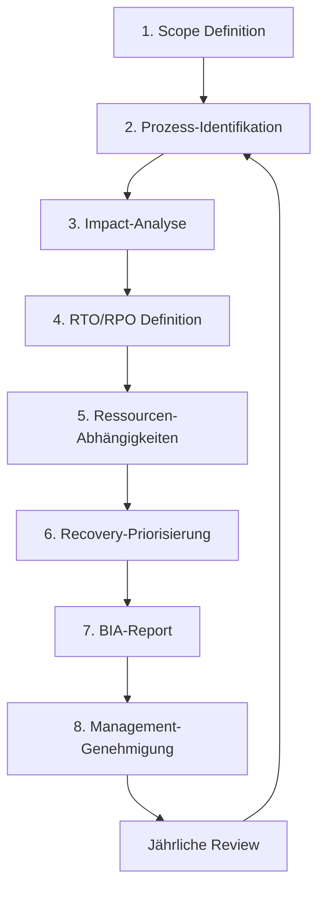
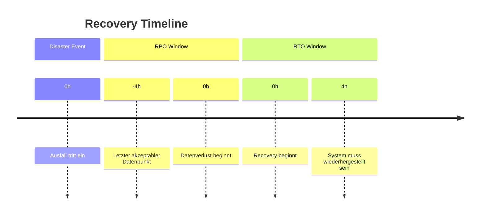
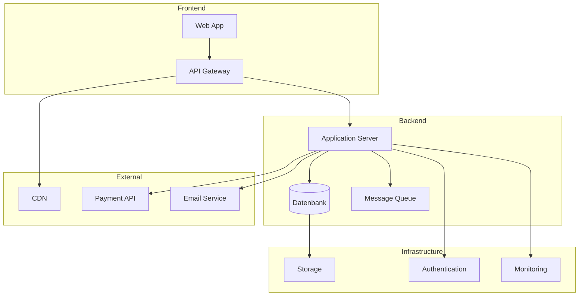

# Business Impact Analysis (BIA) Guide

## Überblick

Die Business Impact Analysis (BIA) identifiziert kritische Geschäftsprozesse und bewertet die Auswirkungen von Ausfällen. Sie bildet die Grundlage für Business Continuity Planning (BCP) und Disaster Recovery (DR) Strategien.

---

## BIA-Prozess



---

## 1. Scope Definition

### Grenzen festlegen

| Aspekt | Definition |
|--------|------------|
| **Organisationseinheiten** | Alle Business Units |
| **Prozesse** | Kern- und unterstützende Prozesse |
| **Systeme** | IT-Systeme, Applikationen, Infrastruktur |
| **Standorte** | Alle physischen Lokationen |
| **Zeitrahmen** | Analyse für 72h, 1 Woche, 1 Monat Ausfall |

---

## 2. Prozess-Identifikation

### Geschäftsprozess-Kategorien

| Kategorie | Beschreibung | Beispiele |
|-----------|--------------|-----------|
| **Kernprozesse** | Direkte Wertschöpfung | Produktion, Vertrieb, Service |
| **Unterstützend** | Ermöglichen Kernprozesse | IT, HR, Finance |
| **Management** | Steuerung & Kontrolle | Strategie, Compliance |

### Prozess-Inventar Template

| Prozess-ID | Prozessname | Abteilung | Typ | Owner | Kritikalität |
|------------|-------------|-----------|-----|-------|--------------|
| BP-001 | Auftragsabwicklung | Vertrieb | Kern | Sales Director | Kritisch |
| BP-002 | Zahlungsabwicklung | Finance | Kern | CFO | Kritisch |
| BP-003 | Kundenservice | Support | Kern | Service Manager | Hoch |
| BP-004 | Personalverwaltung | HR | Support | HR Director | Mittel |
| BP-005 | IT-Betrieb | IT | Support | CIO | Kritisch |

---

## 3. Impact-Analyse

### Impact-Kategorien

| Kategorie | Beschreibung | Messung |
|-----------|--------------|---------|
| **Finanziell** | Umsatzverlust, Mehrkosten | € pro Tag |
| **Operativ** | Produktivitätsverlust | % Kapazität |
| **Rechtlich** | Vertragsstrafen, Bußgelder | € |
| **Reputation** | Kundenvertrauen, Marke | Qualitativ |
| **Compliance** | Regulatorische Verstöße | Severity |

### Impact-Bewertung Matrix

| Zeitraum | Finanziell | Operativ | Rechtlich | Reputation |
|----------|------------|----------|-----------|------------|
| **0-4h** | Minimal | Gering | Keine | Keine |
| **4-24h** | Gering | Mittel | Möglich | Gering |
| **1-3 Tage** | Mittel | Hoch | Wahrscheinlich | Mittel |
| **3-7 Tage** | Hoch | Kritisch | Sicher | Hoch |
| **> 7 Tage** | Kritisch | Katastrophal | Schwerwiegend | Kritisch |

### Impact-Level Definitionen

| Level | Finanzieller Impact | Beschreibung |
|-------|---------------------|--------------|
| **5 - Katastrophal** | > 1M € / Tag | Existenzbedrohend |
| **4 - Kritisch** | 100K - 1M € / Tag | Schwerer Schaden |
| **3 - Erheblich** | 10K - 100K € / Tag | Signifikanter Schaden |
| **2 - Gering** | 1K - 10K € / Tag | Moderater Schaden |
| **1 - Minimal** | < 1K € / Tag | Vernachlässigbar |

---

## 4. RTO/RPO Definition

### Kernbegriffe

```
RTO (Recovery Time Objective)
= Maximale tolerierbare Ausfallzeit
= Zeit bis zur Wiederherstellung der Funktion

RPO (Recovery Point Objective)
= Maximaler tolerierbarer Datenverlust
= Zeitspanne der Daten, die verloren gehen dürfen
```

### RTO/RPO-Klassifizierung

| Tier | RTO | RPO | Backup-Strategie | Kosten |
|------|-----|-----|------------------|--------|
| **Tier 1 - Mission Critical** | < 1h | 0 (Real-time) | Synchrone Replikation | €€€€€ |
| **Tier 2 - Business Critical** | 4h | < 1h | Asynchrone Replikation | €€€€ |
| **Tier 3 - Business Important** | 24h | < 4h | Stündliche Backups | €€€ |
| **Tier 4 - Standard** | 72h | < 24h | Tägliche Backups | €€ |
| **Tier 5 - Non-Critical** | > 72h | < 7 Tage | Wöchentliche Backups | € |

### RTO/RPO Visualisierung



---

## 5. Ressourcen-Abhängigkeiten

### Abhängigkeitsmatrix

| Prozess | IT-Systeme | Personal | Externe Dienste | Standort |
|---------|------------|----------|-----------------|----------|
| Auftragsabwicklung | ERP, CRM | Vertrieb (10) | Payment Provider | HQ, Remote |
| Zahlungsabwicklung | ERP, Banking | Finance (5) | Bank-API | HQ |
| Kundenservice | CRM, Telefonie | Support (15) | Cloud Provider | HQ, Remote |
| IT-Betrieb | Alle Systeme | IT (20) | Cloud, ISP | DC, Remote |

### IT-System Abhängigkeiten



---

## 6. Recovery-Priorisierung

### Priorisierungsmatrix

| Priorität | Prozess | RTO | RPO | Begründung |
|-----------|---------|-----|-----|------------|
| **P1** | Zahlungsabwicklung | 1h | 0 | Umsatzkritisch |
| **P1** | IT-Kerninfrastruktur | 1h | 0 | Basis für alles |
| **P2** | Auftragsabwicklung | 4h | 1h | Kundenzufriedenheit |
| **P2** | Kundenservice | 4h | 4h | SLA-Verpflichtungen |
| **P3** | Personalverwaltung | 24h | 24h | Nicht zeitkritisch |
| **P4** | Reporting | 72h | 24h | Verzögerbar |

### Recovery-Sequenz

```mermaid
gantt
    title Recovery Sequence nach Disaster
    dateFormat HH:mm
    axisFormat %H:%M
    
    section P1 - Kritisch
    Netzwerk-Infrastruktur    :p1a, 00:00, 30m
    Datenbank-Restore         :p1b, after p1a, 30m
    Core Services             :p1c, after p1b, 30m
    
    section P2 - Hoch
    ERP System                :p2a, after p1c, 1h
    CRM System                :p2b, after p1c, 1h
    
    section P3 - Mittel
    HR System                 :p3a, after p2a, 2h
    Reporting                 :p3b, after p2a, 2h
```



---

## 7. BIA-Report Struktur

### Report-Gliederung

1. **Executive Summary**
   - Scope und Methodik
   - Kritische Findings
   - Empfehlungen

2. **Prozess-Analyse**
   - Prozess-Inventar
   - Impact-Bewertungen
   - Abhängigkeiten

3. **Recovery-Anforderungen**
   - RTO/RPO-Matrix
   - Priorisierung
   - Ressourcenbedarf

4. **Gap-Analyse**
   - Aktuelle Capabilities vs. Anforderungen
   - Risiken und Lücken

5. **Empfehlungen**
   - Maßnahmen zur Schließung der Gaps
   - Investitionsbedarf
   - Timeline

---

## 8. BIA Maintenance

### Review-Zyklus

| Aktivität | Frequenz | Trigger |
|-----------|----------|---------|
| Vollständige BIA | Jährlich | Regulär |
| Prozess-Update | Quartalsweise | Änderungen |
| RTO/RPO-Validierung | Halbjährlich | Tests |
| Ad-hoc Review | Nach Bedarf | Incidents, Reorg |

### Change Triggers

- Neue Geschäftsprozesse
- Organisationsänderungen
- Neue IT-Systeme
- Regulatorische Änderungen
- Lessons Learned aus Incidents

---

## Compliance-Referenzen

| Standard | Relevante Abschnitte |
|----------|---------------------|
| ISO 22301 | 8.2.2 Business Impact Analysis |
| ISO 27001 | A.17.1 Information Security Continuity |
| NIST SP 800-34 | Contingency Planning |
| GDPR | Art. 32 (Wiederherstellbarkeit) |

---

## Weiterführende Ressourcen

| Ressource | Link |
|-----------|------|
| ISO 22301:2019 | https://www.iso.org/standard/75106.html |
| NIST SP 800-34 | https://csrc.nist.gov/publications/detail/sp/800-34/rev-1/final |
| BCI Good Practice Guidelines | https://www.thebci.org/training-qualifications/good-practice-guidelines.html |
