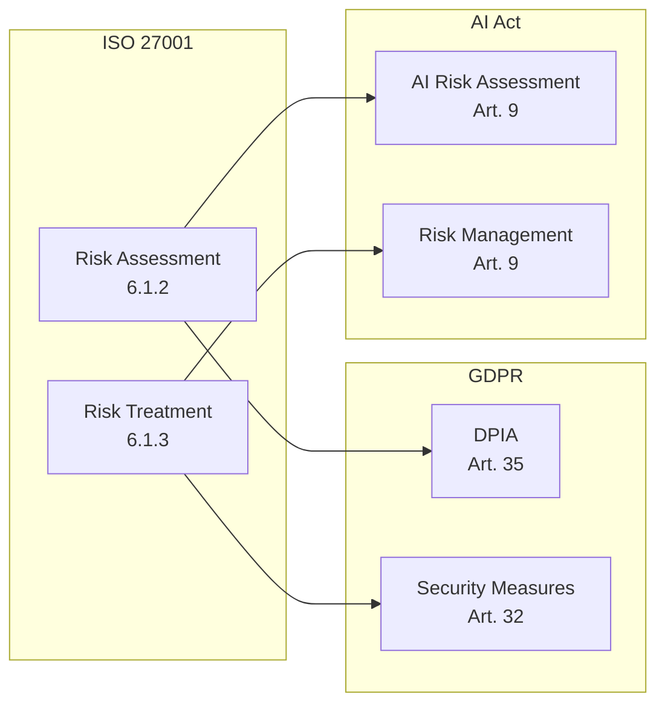
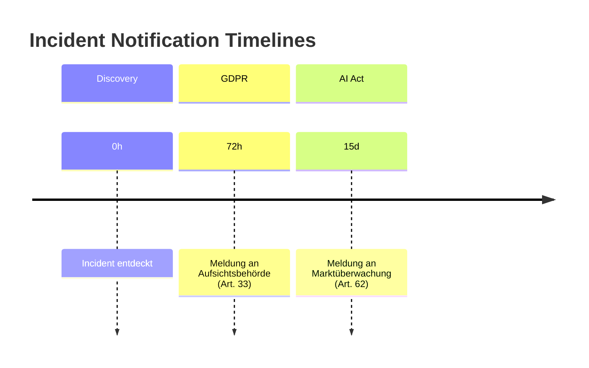

# Compliance Mapping – ISO 27001, GDPR & EU AI Act

## Überblick

Dieses Dokument bietet ein umfassendes Mapping zwischen den drei zentralen Compliance-Frameworks für Information Security und Datenschutz. Es dient als Referenz für Multi-Framework Compliance und Audit-Vorbereitung.

---

## Framework-Übersicht

| Framework | Scope | Verpflichtend | Zertifizierbar |
|-----------|-------|---------------|----------------|
| **ISO/IEC 27001:2022** | Information Security Management | Nein | Ja |
| **GDPR (EU 2016/679)** | Personenbezogene Daten | Ja (EU) | Nein |
| **EU AI Act (2024)** | KI-Systeme | Ja (EU) | Teilweise |

---

## Governance & Management

### ISO 27001 – Kapitel 4-10 (ISMS)

| ISO Control | Beschreibung | GDPR | AI Act |
|-------------|--------------|------|--------|
| 4.1 Understanding the organization | Kontext der Organisation | Art. 24 (Controller responsibility) | Art. 9 (Risk Management) |
| 5.1 Leadership and commitment | Führungsverpflichtung | Art. 24 (Accountability) | Art. 27 (Fundamental rights assessment) |
| 5.2 Policy | Informationssicherheitspolitik | Art. 24, 32 (Policies) | Art. 9 (Governance) |
| 6.1 Risk assessment | Risikobewertung | Art. 35 (DPIA) | Art. 9 (AI Risk Assessment) |
| 7.2 Competence | Kompetenz | Art. 39 (DPO qualifications) | Art. 14 (Human oversight competence) |
| 9.1 Monitoring and measurement | Überwachung und Messung | Art. 32 (Security measures) | Art. 9 (Monitoring) |
| 10.1 Continual improvement | Kontinuierliche Verbesserung | Art. 24 (Review policies) | Art. 9 (Quality management) |

---

## Risk Assessment & Treatment

### ISO 27001 – Clause 6.1, 8.2



| Thema | ISO 27001 | GDPR | AI Act |
|-------|-----------|------|--------|
| Risk Identification | 6.1.2 | Art. 35(7) | Art. 9(2) |
| Risk Analysis | 6.1.2 | Art. 35(7)(c) | Art. 9(2)(a) |
| Risk Evaluation | 6.1.2 | Art. 35(7)(c) | Art. 9(2)(b) |
| Risk Treatment | 6.1.3 | Art. 35(7)(d) | Art. 9(2)(c) |
| Risk Documentation | 6.1.2, 7.5 | Art. 35(7) | Art. 11 |

---

## Access Control

### ISO 27001 Annex A – Abschnitt 5.9-5.18

| ISO Control | Beschreibung | GDPR | AI Act |
|-------------|--------------|------|--------|
| A.5.15 Access control | Zugangskontrolle | Art. 32(1)(b) (Access control) | Art. 14 (Human access) |
| A.5.16 Identity management | Identitätsmanagement | Art. 32 (Authentication) | Art. 14 (User identification) |
| A.5.17 Authentication information | Authentifizierungsinformationen | Art. 32 (Pseudonymization) | - |
| A.5.18 Access rights | Zugriffsrechte | Art. 25 (Data minimization) | Art. 14 (Appropriate access) |

### Implementierungsbeispiel

| Anforderung | ISO Control | GDPR Artikel | AI Act Artikel | Maßnahme |
|-------------|-------------|--------------|----------------|----------|
| Least Privilege | A.5.18 | Art. 25(2) | - | Role-Based Access Control |
| Strong Auth | A.5.17 | Art. 32(1) | Art. 14 | MFA für alle Systeme |
| Access Review | A.5.18 | Art. 5(1)(e) | Art. 14(4)(d) | Quartalsweise Reviews |
| Privileged Access | A.5.18 | Art. 32 | Art. 14 | PAM-Lösung |

---

## Data Protection

### ISO 27001 Annex A – Abschnitt 5.33-5.34, 8.1-8.12

| ISO Control | Beschreibung | GDPR | AI Act |
|-------------|--------------|------|--------|
| A.5.33 Protection of records | Aufzeichnungsschutz | Art. 30 (Records of processing) | Art. 12 (Record-keeping) |
| A.5.34 Privacy and PII | Datenschutz | Art. 5 (Data protection principles) | Art. 10 (Data governance) |
| A.8.10 Information deletion | Datenlöschung | Art. 17 (Right to erasure) | Art. 10(5) (Data deletion) |
| A.8.11 Data masking | Datenmaskierung | Art. 32 (Pseudonymization) | Art. 10(2)(f) (Anonymization) |
| A.8.12 Data leakage prevention | DLP | Art. 32 (Confidentiality) | - |

### GDPR Prinzipien Mapping

| GDPR Prinzip (Art. 5) | Beschreibung | ISO Controls | AI Act |
|----------------------|--------------|--------------|--------|
| Lawfulness, fairness, transparency | Rechtmäßigkeit | 5.1, 5.2 | Art. 13 (Transparency) |
| Purpose limitation | Zweckbindung | A.5.34 | Art. 10(2) |
| Data minimization | Datenminimierung | A.5.34 | Art. 10(3) |
| Accuracy | Richtigkeit | A.5.34 | Art. 10(3) |
| Storage limitation | Speicherbegrenzung | A.8.10 | Art. 10(5) |
| Integrity and confidentiality | Integrität & Vertraulichkeit | A.8.1-A.8.12 | Art. 15 |
| Accountability | Rechenschaftspflicht | 7.5 | Art. 17 |

---

## AI-Specific Requirements (EU AI Act)

### Risiko-Klassifikation

```mermaid
pyramid
    title AI Risk Levels (EU AI Act)
    "Verboten" : Art. 5
    "Hochrisiko" : Art. 6-7
    "Begrenzt" : Art. 50
    "Minimal" : Keine spezif. Anforderungen
```

### High-Risk AI Systems (Art. 6-7)

| Kategorie | Beispiele | Anforderungen |
|-----------|-----------|---------------|
| Biometrische Identifikation | Gesichtserkennung | Art. 9-15 vollständig |
| Kritische Infrastruktur | Energieversorgung | Art. 9-15 vollständig |
| Bildung & Beruf | Bewerbungsscreening | Art. 9-15 vollständig |
| Strafverfolgung | Predictive Policing | Art. 9-15 + Art. 26 |
| Grenzkontrollen | Visa-Entscheidungen | Art. 9-15 vollständig |

### High-Risk AI Compliance Mapping

| AI Act Anforderung | Beschreibung | ISO 27001 | GDPR |
|--------------------|--------------|-----------|------|
| Art. 9 Risk Management | KI-Risikomanagement | 6.1 | Art. 35 |
| Art. 10 Data Governance | Daten-Qualität & Governance | A.5.34, A.8.1 | Art. 5, 25 |
| Art. 11 Technical Documentation | Technische Dokumentation | 7.5 | Art. 30 |
| Art. 12 Record-keeping | Protokollierung | A.8.15, A.8.16 | Art. 30 |
| Art. 13 Transparency | Transparenz | - | Art. 13, 14 |
| Art. 14 Human Oversight | Menschliche Aufsicht | A.5.15 | - |
| Art. 15 Accuracy & Robustness | Genauigkeit & Robustheit | A.8.28 | - |
| Art. 17 Quality Management | Qualitätsmanagement | 10.1 | Art. 24 |

---

## Incident Management

### Cross-Framework Incident Requirements

| Aspekt | ISO 27001 | GDPR | AI Act |
|--------|-----------|------|--------|
| Incident Definition | A.5.24 | Art. 4(12) | Art. 3(49) |
| Detection | A.5.25 | Art. 33 | Art. 62(1) |
| Response | A.5.26 | Art. 33 | Art. 62(1) |
| Reporting (Authority) | - | Art. 33 (72h) | Art. 62 (15 days) |
| Reporting (Affected) | - | Art. 34 | - |
| Documentation | A.5.27 | Art. 33(5) | Art. 62(2) |
| Lessons Learned | A.5.27 | Art. 33 | Art. 9(9) |

### Meldepflichten



---

## Vendor & Third Party Management

| Aspekt | ISO 27001 | GDPR | AI Act |
|--------|-----------|------|--------|
| Due Diligence | A.5.19 | Art. 28(1) | Art. 25 (Distributor duties) |
| Contractual | A.5.20 | Art. 28(3) | Art. 25, 27 |
| Monitoring | A.5.22 | Art. 28(3)(h) | Art. 25 |
| Sub-contractors | A.5.21 | Art. 28(4) | Art. 25 |

---

## Compliance Matrix für Audits

### Control Mapping Tabelle

| ID | Control Theme | ISO 27001:2022 | GDPR | AI Act | Evidence |
|----|---------------|----------------|------|--------|----------|
| CM-001 | Information Security Policy | 5.2, A.5.1 | Art. 24 | Art. 9(1) | Policy Document |
| CM-002 | Risk Assessment | 6.1.2 | Art. 35 | Art. 9(2) | Risk Register |
| CM-003 | Access Control | A.5.15-18 | Art. 32 | Art. 14 | IAM Documentation |
| CM-004 | Data Classification | A.5.12 | Art. 5 | Art. 10 | Classification Scheme |
| CM-005 | Encryption | A.8.24 | Art. 32 | Art. 15 | Crypto Standards |
| CM-006 | Incident Response | A.5.24-27 | Art. 33-34 | Art. 62 | IR Playbook |
| CM-007 | Logging & Monitoring | A.8.15-16 | Art. 30 | Art. 12 | Log Config |
| CM-008 | Business Continuity | A.5.29-30 | Art. 32(1)(c) | - | BCP/DRP |
| CM-009 | Vendor Management | A.5.19-22 | Art. 28 | Art. 25 | Vendor Register |
| CM-010 | Training & Awareness | 7.2, A.6.3 | Art. 39(1)(b) | Art. 14(4) | Training Records |
| CM-011 | Documentation | 7.5 | Art. 30 | Art. 11-12 | Document Register |
| CM-012 | Human Oversight | - | - | Art. 14 | Oversight Procedures |

---

## Implementation Roadmap

### Phase 1: Foundation (0-6 Monate)

- [ ] Policy Framework etablieren
- [ ] Risk Assessment durchführen
- [ ] Asset Inventory erstellen
- [ ] Baseline Controls implementieren

### Phase 2: Core Controls (6-12 Monate)

- [ ] Access Control System
- [ ] Encryption Implementation
- [ ] Incident Response Process
- [ ] Logging & Monitoring

### Phase 3: Advanced (12-18 Monate)

- [ ] AI-specific Controls (falls relevant)
- [ ] Third Party Management
- [ ] Business Continuity
- [ ] Continuous Improvement

---

## Weiterführende Ressourcen

| Ressource | Link |
|-----------|------|
| ISO/IEC 27001:2022 | https://www.iso.org/standard/27001 |
| GDPR Full Text | https://gdpr.eu/tag/gdpr/ |
| EU AI Act | https://artificialintelligenceact.eu/ |
| ENISA AI Security Guidelines | https://www.enisa.europa.eu/topics/ai |
| NIST AI RMF | https://www.nist.gov/itl/ai-risk-management-framework |
