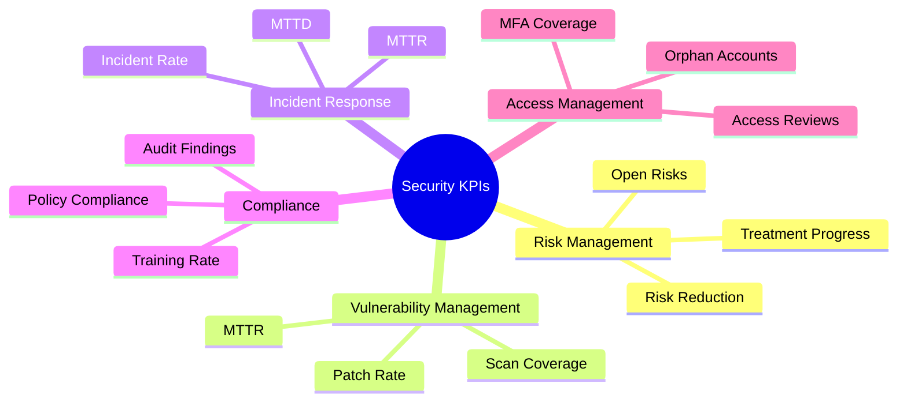
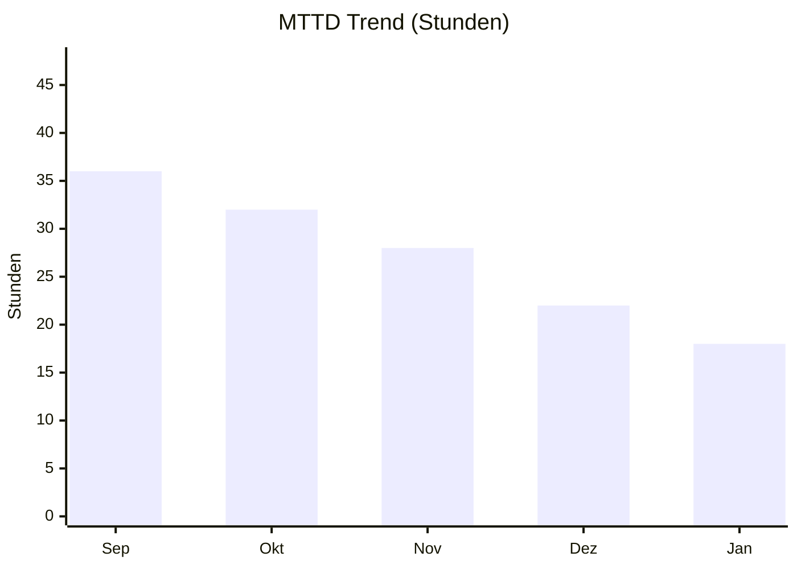

# KPI Framework – Security Metrics & Performance

## Überblick

Dieses Framework definiert Key Performance Indicators (KPIs) und Key Risk Indicators (KRIs) zur Messung und Steuerung der Informationssicherheit. Es dient als Grundlage für Executive Reporting und kontinuierliche Verbesserung.

---

## KPI-Kategorien



---

## Security KPI Dashboard

### Executive Summary

| Kategorie | KPI | Zielwert | Aktuell | Trend | Status |
|-----------|-----|----------|---------|-------|--------|
| **Risk** | Offene Critical Risks | < 2 | 1 | ↓ | 🟢 |
| **Vulnerability** | Patch Compliance Rate | > 95% | 87% | ↑ | 🟡 |
| **Incident** | Mean Time to Detect | < 24h | 18h | ↓ | 🟢 |
| **Compliance** | Audit Findings (Open) | < 5 | 3 | ↓ | 🟢 |
| **Access** | MFA Adoption Rate | 100% | 92% | ↑ | 🟡 |

**Legende:** 🟢 On Track | 🟡 Attention | 🔴 Critical

---

## 1. Risk Management KPIs

### 1.1 Risk Exposure Index

**Definition:** Gesamtrisiko-Score basierend auf allen aktiven Risiken im Risk Register.

```
Risk Exposure Index = Σ (Risk Score × Impact Weight) / Max Possible Score × 100
```

| Zeitraum | Score | Trend |
|----------|-------|-------|
| Q4 2025 | 72 | - |
| Q1 2026 | 65 | ↓ -7 |

**Ziel:** < 50 (Risikotoleranz-Level)

---

### 1.2 Risk Treatment Progress

**Definition:** Prozentsatz der Risiken mit abgeschlossenen Behandlungsmaßnahmen.

| Status | Anzahl | Prozent |
|--------|--------|---------|
| Behandelt | 12 | 60% |
| In Behandlung | 6 | 30% |
| Offen | 2 | 10% |
| **Gesamt** | 20 | 100% |

**Ziel:** > 80% behandelt

---

### 1.3 Mean Time to Risk Mitigation (MTTRM)

**Definition:** Durchschnittliche Zeit von Risikoidentifikation bis zur Implementierung von Gegenmaßnahmen.

| Risikostufe | MTTRM (Ziel) | MTTRM (Aktuell) | Status |
|-------------|--------------|-----------------|--------|
| Critical | < 7 Tage | 5 Tage | 🟢 |
| High | < 30 Tage | 28 Tage | 🟢 |
| Medium | < 90 Tage | 75 Tage | 🟢 |
| Low | < 180 Tage | 120 Tage | 🟢 |

---

## 2. Vulnerability Management KPIs

### 2.1 Patch Compliance Rate

**Definition:** Prozentsatz der Systeme mit aktuellen Sicherheitspatches.

```
Patch Compliance = (Gepatchte Systeme / Gesamtsysteme) × 100
```

| Zeitraum | Rate | Trend |
|----------|------|-------|
| Nov 2025 | 82% | - |
| Dez 2025 | 85% | ↑ +3% |
| Jan 2026 | 87% | ↑ +2% |

**Ziel:** > 95%

---

### 2.2 Mean Time to Remediate (MTTR)

**Definition:** Durchschnittliche Zeit von Vulnerability-Entdeckung bis zur Behebung.

| Severity | MTTR (Ziel) | MTTR (Aktuell) | Status |
|----------|-------------|-----------------|--------|
| Critical | 72h | 96h | 🔴 |
| High | 7 Tage | 8 Tage | 🟡 |
| Medium | 30 Tage | 25 Tage | 🟢 |
| Low | 90 Tage | 60 Tage | 🟢 |

---

### 2.3 Vulnerability Scan Coverage

**Definition:** Prozentsatz der Assets, die regelmäßig gescannt werden.

| Asset-Typ | Gesamt | Gescannt | Coverage |
|-----------|--------|----------|----------|
| Server | 120 | 115 | 96% |
| Workstations | 500 | 480 | 96% |
| Network Devices | 45 | 42 | 93% |
| Cloud Resources | 80 | 75 | 94% |
| **Gesamt** | **745** | **712** | **95.6%** |

**Ziel:** > 98%

---

## 3. Incident Response KPIs

### 3.1 Mean Time to Detect (MTTD)

**Definition:** Durchschnittliche Zeit von Angriffsbeginn bis zur Erkennung.



| Monat | MTTD | Trend |
|-------|------|-------|
| Sep 2025 | 36h | - |
| Okt 2025 | 32h | ↓ -4h |
| Nov 2025 | 28h | ↓ -4h |
| Dez 2025 | 22h | ↓ -6h |
| Jan 2026 | 18h | ↓ -4h |

**Ziel:** < 24h

---

### 3.2 Mean Time to Contain (MTTC)

**Definition:** Durchschnittliche Zeit von Erkennung bis zur Eindämmung.

| Incident-Typ | MTTC (Ziel) | MTTC (Aktuell) | Status |
|--------------|-------------|-----------------|--------|
| Malware | 4h | 3.5h | 🟢 |
| Phishing | 2h | 1.5h | 🟢 |
| Data Breach | 8h | 12h | 🔴 |
| DDoS | 1h | 45min | 🟢 |

---

### 3.3 Security Incident Rate

**Definition:** Anzahl der Security Incidents pro 1.000 Mitarbeiter pro Monat.

| Monat | Incidents | Mitarbeiter | Rate |
|-------|-----------|-------------|------|
| Okt 2025 | 8 | 1.200 | 6.67 |
| Nov 2025 | 6 | 1.200 | 5.00 |
| Dez 2025 | 5 | 1.200 | 4.17 |
| Jan 2026 | 4 | 1.200 | 3.33 |

**Ziel:** < 5 Incidents / 1.000 MA / Monat

---

## 4. Compliance KPIs

### 4.1 Audit Finding Status

**Definition:** Status der offenen Audit-Findings nach Priorität.

| Priorität | Offen | In Arbeit | Geschlossen | Überfällig |
|-----------|-------|-----------|-------------|------------|
| Critical | 0 | 1 | 3 | 0 |
| High | 1 | 2 | 8 | 0 |
| Medium | 2 | 4 | 12 | 1 |
| Low | 0 | 2 | 10 | 0 |
| **Gesamt** | **3** | **9** | **33** | **1** |

**Ziel:** 0 Critical/High Findings offen

---

### 4.2 Policy Compliance Rate

**Definition:** Prozentsatz der Systeme/Prozesse, die alle relevanten Policies erfüllen.

| Policy Domain | Systeme | Compliant | Rate |
|---------------|---------|-----------|------|
| Password Policy | 745 | 720 | 97% |
| Encryption Standards | 200 | 185 | 93% |
| Logging Requirements | 165 | 160 | 97% |
| Access Control | 745 | 700 | 94% |

**Ziel:** > 95% pro Domain

---

### 4.3 Security Training Completion

**Definition:** Prozentsatz der Mitarbeiter mit abgeschlossener Security Awareness Schulung.

| Abteilung | Mitarbeiter | Geschult | Rate |
|-----------|-------------|----------|------|
| IT | 80 | 80 | 100% |
| Finance | 120 | 115 | 96% |
| Sales | 200 | 180 | 90% |
| Operations | 400 | 360 | 90% |
| Management | 50 | 48 | 96% |
| **Gesamt** | **850** | **783** | **92%** |

**Ziel:** 100% innerhalb von 30 Tagen nach Onboarding, jährliche Auffrischung

---

## 5. Access Management KPIs

### 5.1 MFA Adoption Rate

**Definition:** Prozentsatz der Benutzerkonten mit aktivierter Multi-Faktor-Authentifizierung.

| Benutzergruppe | Accounts | MFA aktiv | Rate |
|----------------|----------|-----------|------|
| Privileged Users | 50 | 50 | 100% |
| Standard Users | 800 | 735 | 92% |
| Service Accounts | 100 | 80 | 80% |
| **Gesamt** | **950** | **865** | **91%** |

**Ziel:** 100% für alle Benutzer

---

### 5.2 Orphaned Accounts

**Definition:** Anzahl der Accounts ohne zugeordneten aktiven Mitarbeiter.

| Monat | Gefunden | Bereinigt | Verbleibend |
|-------|----------|-----------|-------------|
| Nov 2025 | 35 | 30 | 5 |
| Dez 2025 | 8 | 10 | 3 |
| Jan 2026 | 5 | 6 | 2 |

**Ziel:** < 5 Orphaned Accounts

---

### 5.3 Access Review Completion

**Definition:** Prozentsatz der abgeschlossenen quartalsweisen Access Reviews.

| System | Due Date | Completed | Status |
|--------|----------|-----------|--------|
| Active Directory | 2026-01-15 | 2026-01-10 | ✅ |
| ERP System | 2026-01-15 | - | 🔄 In Progress |
| Cloud Console | 2026-01-15 | 2026-01-08 | ✅ |
| HR System | 2026-01-15 | - | ⏳ Pending |

**Ziel:** 100% bis Deadline

---

## KPI Reporting

### Report-Frequenz

| Report-Typ | Zielgruppe | Frequenz | Inhalt |
|------------|------------|----------|--------|
| Executive Dashboard | C-Level, Board | Monatlich | High-Level KPIs, Trends |
| Operational Report | IT Management | Wöchentlich | Detaillierte Metriken |
| Compliance Report | Auditoren, DPO | Quartalsweise | Compliance Status |
| Incident Report | CISO, SOC | Nach Bedarf | Incident Details |

---

### KPI Governance

| Aktivität | Frequenz | Verantwortlich |
|-----------|----------|----------------|
| KPI-Definition Review | Jährlich | CISO |
| Zielwert-Anpassung | Halbjährlich | GRC Team |
| Datenqualitätsprüfung | Quartalsweise | Security Analyst |
| Dashboard-Update | Monatlich | Security Analyst |

---

## Weiterführende Ressourcen

| Ressource | Link |
|-----------|------|
| NIST SP 800-55 | https://csrc.nist.gov/publications/detail/sp/800-55/rev-1/final |
| CIS Controls Metrics | https://www.cisecurity.org/controls |
| ISO 27004:2016 | https://www.iso.org/standard/64120.html |
