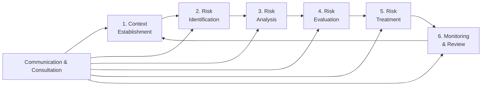
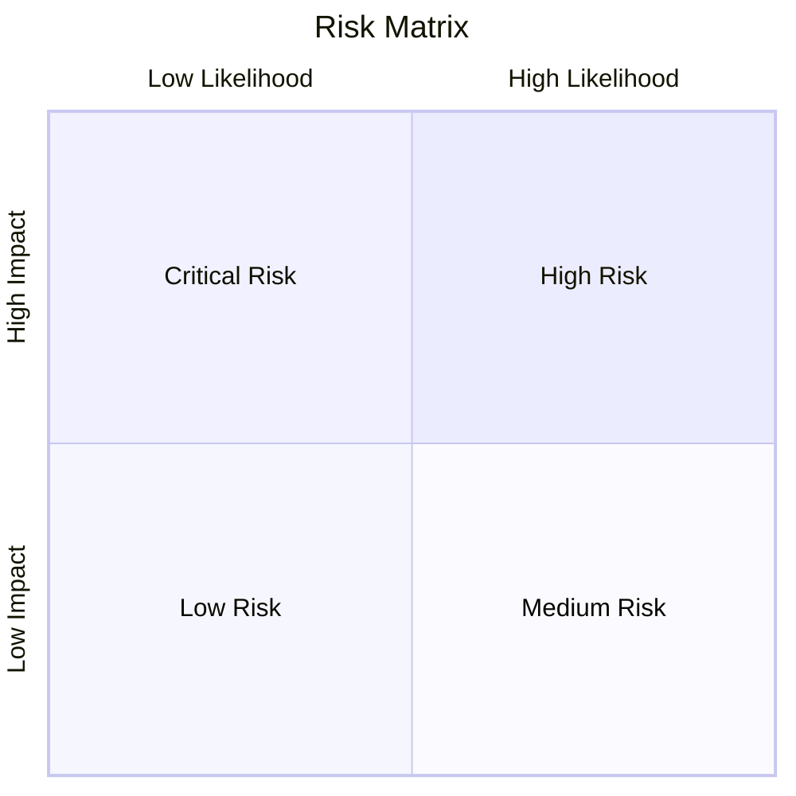
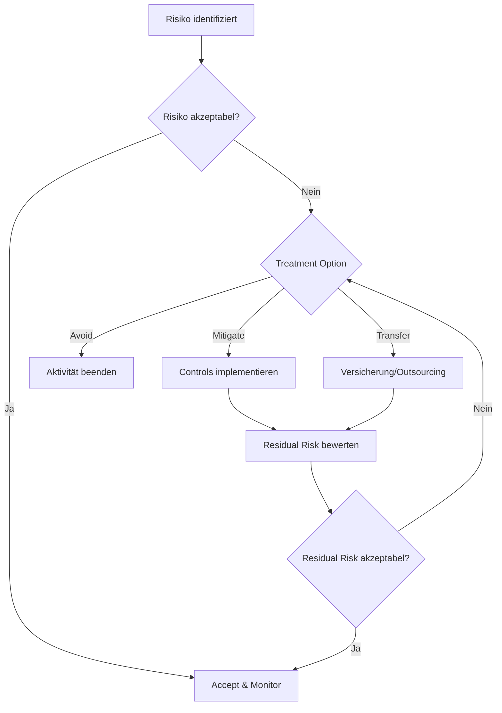

# Risk Management Methodology

## Überblick

Diese Methodik beschreibt den strukturierten Ansatz zur Identifikation, Bewertung und Behandlung von Informationssicherheitsrisiken. Sie basiert auf **ISO 27005**, **NIST SP 800-30** und integrierten Best Practices.

---

## Risk Management Lifecycle



---

## 1. Context Establishment

### Ziel
Definition des Rahmens für das Risikomanagement.

### Aktivitäten
- Scope und Grenzen festlegen
- Risk Appetite und Risk Tolerance definieren
- Bewertungskriterien festlegen
- Stakeholder identifizieren

### Risk Appetite Levels

| Level | Beschreibung | Beispiel |
|-------|--------------|----------|
| **Averse** | Minimale Risikobereitschaft | Kritische Infrastruktur |
| **Minimal** | Geringe Risikobereitschaft | Finanzsektor |
| **Cautious** | Vorsichtige Risikobereitschaft | Standard-Enterprise |
| **Open** | Offene Risikobereitschaft | Startups |
| **Hungry** | Hohe Risikobereitschaft | Venture Capital |

---

## 2. Risk Identification

### Methoden

| Methode | Beschreibung | Anwendung |
|---------|--------------|-----------|
| **Asset-based** | Ausgehend von Assets und deren Bedrohungen | IT-Assets, Daten |
| **Threat-based** | Ausgehend von bekannten Bedrohungen | Threat Intelligence |
| **Vulnerability-based** | Ausgehend von Schwachstellen | Vulnerability Scans |
| **Scenario-based** | Ausgehend von Angriffsszenarien | Tabletop Exercises |

### Risiko-Komponenten

```
Risiko = Bedrohung × Schwachstelle × Auswirkung
         (Threat)    (Vulnerability)   (Impact)
```

### Kategorien

| Kategorie | Beispiele |
|-----------|-----------|
| **Technisch** | Malware, System-Ausfälle, Datenverlust |
| **Organisatorisch** | Prozessfehler, Ressourcenmangel |
| **Menschlich** | Social Engineering, Insider Threats |
| **Extern** | Naturkatastrophen, Supply Chain |
| **Compliance** | Regulatorische Verstöße, Audits |

---

## 3. Risk Analysis

### Qualitative Analyse

#### Likelihood (Eintrittswahrscheinlichkeit)

| Level | Beschreibung | Häufigkeit |
|-------|--------------|------------|
| **5 - Almost Certain** | Wird sehr wahrscheinlich eintreten | > 1x pro Jahr |
| **4 - Likely** | Wird wahrscheinlich eintreten | 1x pro Jahr |
| **3 - Possible** | Könnte eintreten | 1x alle 2-3 Jahre |
| **2 - Unlikely** | Unwahrscheinlich | 1x alle 5-10 Jahre |
| **1 - Rare** | Sehr unwahrscheinlich | < 1x alle 10 Jahre |

#### Impact (Auswirkung)

| Level | Finanziell | Operativ | Reputation | Compliance |
|-------|------------|----------|------------|------------|
| **5 - Catastrophic** | > 10M € | Vollständiger Ausfall | Existenzbedrohend | Lizenzverlust |
| **4 - Major** | 1-10M € | Kritische Systeme | Nationale Medien | Hohe Strafen |
| **3 - Moderate** | 100K-1M € | Wichtige Prozesse | Regionale Medien | Abmahnung |
| **2 - Minor** | 10K-100K € | Einzelne Systeme | Beschwerden | Hinweis |
| **1 - Insignificant** | < 10K € | Minimale Störung | Keine | Keine |

### Quantitative Analyse

```
ALE (Annual Loss Expectancy) = SLE × ARO

Wobei:
- SLE = Single Loss Expectancy (Schadenshöhe pro Ereignis)
- ARO = Annual Rate of Occurrence (Häufigkeit pro Jahr)
```

**Beispiel:**
- Ransomware-Angriff: SLE = 500.000 €
- Erwartete Häufigkeit: ARO = 0,2 (alle 5 Jahre)
- **ALE = 500.000 × 0,2 = 100.000 € pro Jahr**

---

## 4. Risk Evaluation

### Risk Matrix (5×5)



| Impact ↓ / Likelihood → | 1 Rare | 2 Unlikely | 3 Possible | 4 Likely | 5 Almost Certain |
|-------------------------|--------|------------|------------|----------|------------------|
| **5 Catastrophic** | Medium | High | High | Critical | Critical |
| **4 Major** | Medium | Medium | High | High | Critical |
| **3 Moderate** | Low | Medium | Medium | High | High |
| **2 Minor** | Low | Low | Medium | Medium | High |
| **1 Insignificant** | Low | Low | Low | Medium | Medium |

### Risikostufen

| Stufe | Score | Beschreibung | Maßnahme |
|-------|-------|--------------|----------|
| **Critical** | 20-25 | Sofortiges Handeln erforderlich | Eskalation an Management |
| **High** | 12-19 | Prioritäre Behandlung | Maßnahmen innerhalb 30 Tagen |
| **Medium** | 6-11 | Geplante Behandlung | Maßnahmen innerhalb 90 Tagen |
| **Low** | 1-5 | Akzeptabel | Monitoring |

---

## 5. Risk Treatment

### Behandlungsoptionen

| Option | Beschreibung | Beispiel |
|--------|--------------|----------|
| **Avoid** | Risiko vermeiden | Dienst nicht nutzen |
| **Mitigate** | Risiko reduzieren | Sicherheitsmaßnahmen |
| **Transfer** | Risiko übertragen | Versicherung, Outsourcing |
| **Accept** | Risiko akzeptieren | Dokumentierte Entscheidung |

### Treatment Workflow



### Inherent vs. Residual Risk

```
Inherent Risk = Risiko OHNE Kontrollen
Residual Risk = Risiko MIT implementierten Kontrollen

Risikoreduktion = Inherent Risk - Residual Risk
```

---

## 6. Monitoring & Review

### Key Risk Indicators (KRIs)

| KRI | Schwellwert | Messung |
|-----|-------------|---------|
| Offene kritische Risiken | < 3 | Monatlich |
| Überfällige Maßnahmen | < 5 | Wöchentlich |
| Risk Treatment Progress | > 80% | Quartalsweise |
| New Risks Identified | Trend | Monatlich |

### Review-Zyklen

| Aktivität | Frequenz | Verantwortlich |
|-----------|----------|----------------|
| Risk Register Update | Monatlich | Risk Owner |
| Risk Review Meeting | Quartalsweise | GRC Team |
| Full Risk Assessment | Jährlich | CISO |
| Management Review | Halbjährlich | C-Level |

---

## Rollen & Verantwortlichkeiten

| Rolle | Verantwortlichkeiten |
|-------|---------------------|
| **Risk Owner** | Verantwortlich für einzelne Risiken und deren Behandlung |
| **Control Owner** | Verantwortlich für Implementierung und Wirksamkeit von Controls |
| **Risk Manager** | Koordination des Risikomanagement-Prozesses |
| **CISO** | Gesamtverantwortung für Information Security Risks |
| **Board/Management** | Risk Appetite, Ressourcen, Eskalationsentscheidungen |

---

## Compliance-Referenzen

| Standard | Relevante Abschnitte |
|----------|---------------------|
| ISO 27001:2022 | 6.1 (Risk Assessment), 8.2 (Risk Treatment) |
| ISO 27005:2022 | Vollständiger Risk Management Standard |
| NIST SP 800-30 | Risk Assessment Guide |
| NIST CSF 2.0 | ID.RA (Risk Assessment), GV.RM (Risk Management) |

---

## Dokumentation

Alle Risiken müssen im **Risk Register** dokumentiert werden mit:
- Eindeutige Risk ID
- Beschreibung und Kategorie
- Likelihood und Impact Bewertung
- Risk Score (Inherent & Residual)
- Treatment Option und Maßnahmen
- Risk Owner und Timeline
- Status und Kommentare
