# Business Continuity & Disaster Recovery Plan Template

## Dokumentinformationen

| Feld | Wert |
|------|------|
| **Organisation** | [Organisation Name] |
| **Plan-Typ** | Business Continuity & Disaster Recovery |
| **Version** | 1.0 |
| **Erstellt am** | [Datum] |
| **Letzte Aktualisierung** | [Datum] |
| **Nächste Review** | [Datum + 12 Monate] |
| **Plan Owner** | [Name, Rolle] |
| **Klassifikation** | Vertraulich |

---

## Plan Distribution

| Name | Rolle | Standort | Kontakt |
|------|-------|----------|---------|
| [Name] | Crisis Manager | HQ | [Tel/E-Mail] |
| [Name] | IT Lead | HQ | [Tel/E-Mail] |
| [Name] | Operations Lead | HQ | [Tel/E-Mail] |
| [Name] | HR Lead | HQ | [Tel/E-Mail] |
| [Name] | Communications | HQ | [Tel/E-Mail] |

---

## 1. Plan-Übersicht

### 1.1 Zweck

Dieser Plan beschreibt die Verfahren zur:
- Aufrechterhaltung kritischer Geschäftsfunktionen während Störfällen
- Wiederherstellung von IT-Systemen nach einem Disaster
- Koordinierten Reaktion auf Krisen

### 1.2 Scope

| Element | In Scope | Out of Scope |
|---------|----------|--------------|
| Standorte | [Liste] | [Liste] |
| Systeme | [Liste] | [Liste] |
| Prozesse | [Liste] | [Liste] |

### 1.3 Aktivierung

Dieser Plan wird aktiviert bei:
- [ ] Totalausfall des Hauptstandorts
- [ ] IT-Disaster (Cyberangriff, Hardware-Ausfall)
- [ ] Naturkatastrophen
- [ ] Pandemie / Personalausfall > 30%
- [ ] Kritischer Lieferantenausfall

---

## 2. Crisis Management

### 2.1 Crisis Management Team (CMT)

```
                    ┌─────────────────┐
                    │ Crisis Manager  │
                    │   (CEO/COO)     │
                    └────────┬────────┘
                             │
       ┌─────────────────────┼─────────────────────┐
       │                     │                     │
┌──────┴──────┐       ┌──────┴──────┐       ┌──────┴──────┐
│ IT Lead     │       │ Ops Lead    │       │ Comms Lead  │
│ (CIO/CISO)  │       │ (COO)       │       │ (PR/Mktg)   │
└─────────────┘       └─────────────┘       └─────────────┘
       │                     │                     │
┌──────┴──────┐       ┌──────┴──────┐       ┌──────┴──────┐
│ DR Team     │       │ BC Team     │       │ HR Lead     │
└─────────────┘       └─────────────┘       └─────────────┘
```

### 2.2 Rollen & Verantwortlichkeiten

| Rolle | Verantwortlichkeiten | Backup |
|-------|---------------------|--------|
| **Crisis Manager** | Gesamtleitung, Eskalation, Entscheidungen | [Name] |
| **IT Lead** | IT-Recovery, DR-Aktivierung | [Name] |
| **Operations Lead** | Betriebliche Kontinuität | [Name] |
| **Communications Lead** | Interne/externe Kommunikation | [Name] |
| **HR Lead** | Mitarbeiterbelange, Notfallkontakte | [Name] |
| **Legal/Compliance** | Rechtliche Aspekte, Meldepflichten | [Name] |

### 2.3 Eskalationsstufen

| Stufe | Kriterien | Aktiviert durch | Actions |
|-------|-----------|-----------------|---------|
| **Level 1** | Lokaler Incident | Department Head | Local Response |
| **Level 2** | Abteilungsübergreifend | BU Director | CMT Notification |
| **Level 3** | Unternehmensweit | CEO/CMT | Full Plan Activation |

---

## 3. Notification & Communication

### 3.1 Notfall-Kontaktliste

| Priorität | Kontakt | Telefon | E-Mail | Rolle |
|-----------|---------|---------|--------|-------|
| 1 | [Name] | [Tel] | [E-Mail] | Crisis Manager |
| 2 | [Name] | [Tel] | [E-Mail] | IT Lead |
| 3 | [Name] | [Tel] | [E-Mail] | Operations Lead |

### 3.2 Kommunikationskanäle

| Kanal | Primär | Backup | Für |
|-------|--------|--------|-----|
| Telefon | Festnetz | Mobil | CMT-Koordination |
| E-Mail | Exchange | Gmail Backup | Dokumentation |
| Messenger | MS Teams | WhatsApp Gruppe | Schnellkommunikation |
| Konferenz | Zoom | Teams | Meetings |

### 3.3 Kommunikations-Templates

#### Interne Mitarbeiter-Kommunikation

```
Betreff: [WICHTIG] Geschäftsunterbrechung - [Datum]

Liebe Kolleginnen und Kollegen,

aufgrund [Beschreibung des Vorfalls] müssen wir folgende Maßnahmen einleiten:

- [Maßnahme 1]
- [Maßnahme 2]
- [Maßnahme 3]

Bitte [Anweisungen].

Weitere Updates folgen über [Kanal].

Bei Fragen wenden Sie sich an [Kontakt].

Mit freundlichen Grüßen,
[Name]
Crisis Management Team
```

#### Externe Kunden-Kommunikation

```
Betreff: Servicestatus-Update - [Datum]

Sehr geehrte Kunden,

wir möchten Sie darüber informieren, dass [Beschreibung].

Aktueller Status: [Status]
Voraussichtliche Wiederherstellung: [Zeit]

Wir entschuldigen uns für etwaige Unannehmlichkeiten.

Für dringende Anfragen: [Kontakt]

Mit freundlichen Grüßen,
[Name]
```

---

## 4. Business Continuity Procedures

### 4.1 Kritische Prozesse & Workarounds

| Prozess | RTO | Normal-Modus | Workaround | Verantwortlich |
|---------|-----|--------------|------------|----------------|
| [Prozess 1] | 1h | [System] | [Alternative] | [Name] |
| [Prozess 2] | 4h | [System] | [Alternative] | [Name] |
| [Prozess 3] | 24h | [System] | [Alternative] | [Name] |

### 4.2 Alternativer Standort

| Aspekt | Details |
|--------|---------|
| **Standort** | [Adresse] |
| **Kapazität** | [Arbeitsplätze] |
| **Ausstattung** | [Liste] |
| **Aktivierungszeit** | [Zeit] |
| **Kontakt** | [Name, Tel] |

### 4.3 Remote-Work-Prozeduren

| Schritt | Aktion | Verantwortlich |
|---------|--------|----------------|
| 1 | Remote-Work aktivieren | IT Lead |
| 2 | VPN-Kapazität prüfen | IT Ops |
| 3 | Mitarbeiter informieren | HR/Comms |
| 4 | Helpdesk verstärken | IT Support |
| 5 | Tägliche Check-ins einrichten | Team Leads |

---

## 5. Disaster Recovery Procedures

### 5.1 Recovery-Prioritäten

| Priorität | System | RTO | RPO | Recovery-Team |
|-----------|--------|-----|-----|---------------|
| P1 | Network/Firewall | 30min | - | Network Team |
| P1 | Active Directory | 30min | 0 | Windows Team |
| P1 | DNS/DHCP | 30min | - | Network Team |
| P2 | Datenbank-Cluster | 1h | 15min | DBA Team |
| P2 | E-Mail-System | 2h | 1h | Messaging Team |
| P3 | ERP-System | 4h | 1h | App Team |
| P3 | CRM-System | 4h | 1h | App Team |
| P4 | Reporting | 24h | 24h | BI Team |

### 5.2 Recovery-Sequenz

```mermaid
gantt
    title DR Recovery Timeline
    dateFormat HH:mm
    axisFormat %H:%M
    
    section Phase 1 - Infra
    Netzwerk aktivieren    :p1a, 00:00, 30m
    AD/DNS wiederherstellen :p1b, after p1a, 30m
    
    section Phase 2 - Core
    Datenbanken            :p2a, after p1b, 60m
    E-Mail                 :p2b, after p1b, 60m
    
    section Phase 3 - Apps
    ERP System             :p3a, after p2a, 120m
    CRM System             :p3b, after p2a, 60m
    
    section Phase 4 - Secondary
    Reporting              :p4a, after p3a, 120m
```



### 5.3 System-spezifische Procedures

#### Active Directory Recovery

| Schritt | Aktion | Erwartete Dauer |
|---------|--------|-----------------|
| 1 | DC1 aus Backup wiederherstellen | 15 min |
| 2 | DNS-Dienste prüfen | 5 min |
| 3 | Replikation starten | 10 min |
| 4 | Authentifizierung testen | 5 min |

#### Datenbank Recovery

| Schritt | Aktion | Erwartete Dauer |
|---------|--------|-----------------|
| 1 | Letzten Backup identifizieren | 5 min |
| 2 | Restore auf DR-Server | 30 min |
| 3 | Transaction Logs anwenden | 15 min |
| 4 | Integrity Check | 10 min |
| 5 | Application Connectivity testen | 10 min |

---

## 6. Checklisten

### 6.1 Erste Reaktion (0-30 Minuten)

- [ ] Vorfall bestätigen und dokumentieren
- [ ] CMT informieren
- [ ] Eskalationsstufe festlegen
- [ ] War Room / Konferenz einrichten
- [ ] Erste Lagekommunikation

### 6.2 Assessment (30 Min - 2 Stunden)

- [ ] Schadensausmaß bewerten
- [ ] Betroffene Systeme identifizieren
- [ ] RTO-Anforderungen prüfen
- [ ] Recovery-Strategie festlegen
- [ ] Ressourcen mobilisieren

### 6.3 Recovery (2-24 Stunden)

- [ ] DR-Plan aktivieren
- [ ] Systeme priorisiert wiederherstellen
- [ ] Workarounds implementieren
- [ ] Fortschritt dokumentieren
- [ ] Stakeholder informieren

### 6.4 Normalisierung (24+ Stunden)

- [ ] Systeme vollständig wiederherstellen
- [ ] Workarounds beenden
- [ ] Performance validieren
- [ ] Lessons Learned dokumentieren
- [ ] Plan aktualisieren

---

## 7. Testing & Maintenance

### 7.1 Test-Schedule

| Test-Typ | Frequenz | Nächster Test | Verantwortlich |
|----------|----------|---------------|----------------|
| Plan Review | Quartalsweise | [Datum] | BC Manager |
| Tabletop Exercise | Halbjährlich | [Datum] | CMT |
| DR-Test | Jährlich | [Datum] | IT Lead |
| Full-Scale Test | Alle 2 Jahre | [Datum] | BC Manager |

### 7.2 Plan-Maintenance

| Trigger | Aktion |
|---------|--------|
| Organisationsänderung | Plan Review & Update |
| Neue IT-Systeme | DR-Procedure ergänzen |
| Nach Incident | Lessons Learned integrieren |
| Jährlich | Vollständige Review |

---

## 8. Anhänge

### A. Wichtige Kontakte

#### Interne Kontakte
[Liste mit Namen, Rollen, Telefonnummern]

#### Externe Kontakte

| Organisation | Kontakt | Telefon | Zweck |
|--------------|---------|---------|-------|
| Stromversorger | [Name] | [Tel] | Stromausfall |
| ISP | [Name] | [Tel] | Internet |
| Cloud Provider | [Name] | [Tel] | Cloud-Services |
| Versicherung | [Name] | [Tel] | Schadensmeldung |

### B. System-Dokumentation

[Links zu technischer Dokumentation]

### C. Standort-Informationen

[Adressen, Zugangscodes, Schlüsselverwaltung]

---

## Genehmigung

| Rolle | Name | Datum | Unterschrift |
|-------|------|-------|--------------|
| BC Manager | [Name] | [Datum] | _______________ |
| IT-Leitung | [Name] | [Datum] | _______________ |
| Operations | [Name] | [Datum] | _______________ |
| CEO | [Name] | [Datum] | _______________ |

---

## Änderungshistorie

| Version | Datum | Autor | Änderungen |
|---------|-------|-------|------------|
| 1.0 | [Datum] | [Name] | Initiale Erstellung |
