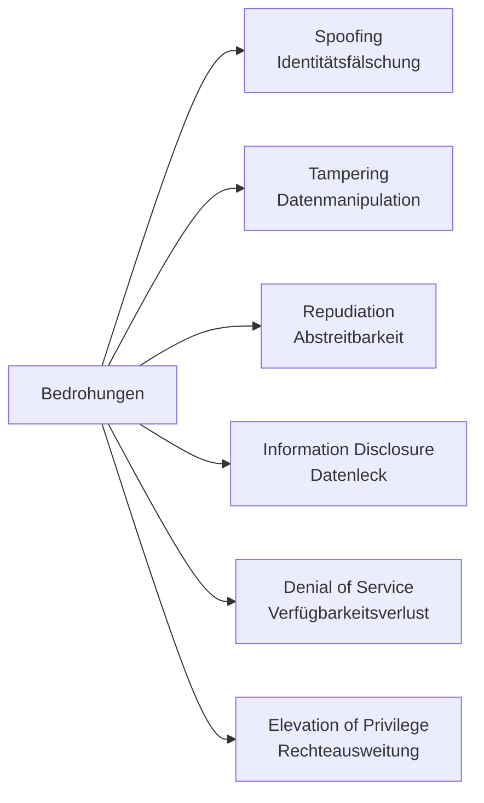

# Bedrohungskategorien – STRIDE & DREAD

Dieses Kapitel behandelt zwei bewährte Modelle zur Klassifikation und Bewertung von Bedrohungen: **STRIDE** (Modellierung) und **DREAD** (Bewertung). Beide helfen, Angriffsvektoren systematisch zu analysieren und Risiken zu priorisieren.

---

## 1. STRIDE – Übersicht & Erklärung

STRIDE steht für sechs Bedrohungskategorien, die typischerweise in IT-Systemen auftreten. Jede Kategorie beschreibt ein Angriffsziel oder -muster.

| Buchstabe | Kategorie              | Beschreibung                                                 | Beispiel                                              |
|-----------|------------------------|---------------------------------------------------------------|-------------------------------------------------------|
| S         | Spoofing               | Identitätsfälschung – sich als jemand anderes ausgeben       | Angreifer meldet sich mit gestohlenem Login an       |
| T         | Tampering              | Manipulation von Daten oder Systemen                         | Unberechtigter ändert eine Konfigurationsdatei       |
| R         | Repudiation            | Abstreiten von Aktionen ohne Beweis                          | Benutzer bestreitet, eine Datei gelöscht zu haben    |
| I         | Information Disclosure | Unautorisierte Offenlegung von Informationen                 | Zugriff auf vertrauliche Kundendaten ohne Berechtigung |
| D         | Denial of Service      | Verfügbarkeitsverlust durch Überlastung oder Blockierung     | Server wird durch Botnetz lahmgelegt                 |
| E         | Elevation of Privilege| Ausweitung der Berechtigungen über das vorgesehene Maß hinaus| Normaler User wird Admin durch Exploit               |

---

## 2. DREAD – Risikobewertung

DREAD ist ein Bewertungsmodell, mit dem Bedrohungen priorisiert werden. Es vergibt für jede Kategorie einen Punktwert von 1 (gering) bis 10 (hoch).

| Buchstabe | Bewertungskategorie  | Leitfrage                                                        |
|-----------|----------------------|-------------------------------------------------------------------|
| D         | Damage               | Wie hoch ist der Schaden bei erfolgreichem Angriff?              |
| R         | Reproducibility      | Wie einfach lässt sich der Angriff wiederholen?                  |
| E         | Exploitability       | Wie aufwendig ist der Angriff technisch?                         |
| A         | Affected Users       | Wie viele Nutzer sind betroffen?                                |
| D         | Discoverability      | Wie leicht lässt sich die Schwachstelle finden?                  |

**Gesamtrisiko = Durchschnitt oder Summe der Punkte**

---

## 3. Anwendung: Alltags- und IT-Beispiele (STRIDE)

| Kategorie     | Beispiel aus dem Alltag                        | Beispiel aus der IT                                       |
|---------------|------------------------------------------------|------------------------------------------------------------|
| Spoofing      | Betrüger ruft als „Bankberater“ an             | Angreifer nutzt gestohlenes Admin-Login                    |
| Tampering     | Jemand verändert vertraulich ein ärztliches Rezept | Angreifer manipuliert Software-Update                      |
| Repudiation   | Kind behauptet, keine Vase zerbrochen zu haben | User bestreitet, kritische Datei gelöscht zu haben         |
| Info Disclosure| Mitarbeiter gibt Passwörter weiter            | S3-Bucket mit Kundendaten öffentlich erreichbar            |
| DoS           | Telefon wird ununterbrochen angerufen          | Botnetz überlastet Webserver                               |
| Privilege Esc.| Azubi übernimmt Chefrolle in E-Mail-System     | Angreifer wird durch Exploit Domain Admin                  |

---

## 4. Visualisierung: STRIDE-Modell als Bedrohungstypen

---
